#	EcoMind by GreenMinds
<div align="center">
<br><br>
 <br><br>

**Universidad Peruana de Ciencias Aplicadas (UPC)**

Facultad de Ingeniería
Carrera de Ingeniería de Software

Ciclo 2026-10 <br><br>

Desarrollo de Aplicaciones Open Source

NRC:11990

Profesor: Juan Antonio Flores Moroco <br><br>

Informe del Trabajo Final

Startup: GreenMinds

Product: EcoMind <br><br>

Integrantes:

u20241e158 - Aponte Pablo, Isabel Luisa

u202410678 - Astocondor Bazan, Alejandra Isabel

u202410254 - Dulanto Espino, Leo César

u202412316 - Diaz Martinez, Alexther Kamil

u202418655 - Laura Acosta, Victor Jhosuef


Abril 2026

</div>

# Registro de Versiones del Informe

| Version | Fecha | Autor | Descripción de modificación |
| -------- | -------- | -------- | -------- |
| 1.0.0    | 4/04/26     | Alejandra Astocondor     | initial commit <br> docs: añadir estructura del proyecto |
| 1.0.0    | 13/04/26     | Alejandra Astocondor <br> Isabel Aponte    | docs: agregar antecedentes y problematica <br> docs: añadir Lean UX Problem Statement <br> docs: Añadir segmento objetivo  |
| 1.1.0    | 16/04/26     | Leo Dulanto   | docs: agregar Lean UX assumptions <br> docs: agregar Lean UX Hypothesis Statements <br> docs: agregar Lean UX Canvas <br> docs: agregar analisis competitivo <br> docs: agregar diseño de entrevistas |

# Projet Report Collaboration Insights

Project Report URL: https://github.com/GreeenMinds/EcoMind_Docs

# Tabla de contenidos

**Capítulo I: Introducción**  
1.1. [Startup Profile](#11-startup-profile)  
1.1.1. [Descripción del startup](#111-descripción-del-startup)  
1.1.2. [Perfiles de integrantes del equipo](#112-perfiles-de-integrantes-del-equipo)  

1.2. [Solution Profile](#12-solution-profile)  
1.2.1. [Antecedentes y problemática](#121-antecedentes-y-problemática)  
1.2.2. [Lean UX Process](#122-lean-ux-process)  
1.2.2.1. [Lean UX Problem Statements](#1221-lean-ux-problem-statements)  
1.2.2.2. [Lean UX Assumptions](#1222-lean-ux-assumptions)  
1.2.2.3. [Lean UX Hypothesis Statements](#1223-lean-ux-hypothesis-statements)  
1.2.2.4. [Lean UX Canvas](#1224-lean-ux-canvas)  

1.3. [Segmentos objetivo](#13-segmentos-objetivo)  


**Capítulo II: Requirements Elicitation & Analysis**  
2.1. [Competidores](#21-competidores)  
2.1.1. [Análisis competitivo](#211-análisis-competitivo)  
2.1.2. [Estrategias y tácticas frente a competidores](#212-estrategias-y-tácticas-frente-a-competidores)  

2.2. [Entrevistas](#22-entrevistas)  
2.2.1. [Diseño de entrevistas](#221-diseño-de-entrevistas)  
2.2.2. [Registro de entrevistas](#222-registro-de-entrevistas)  
2.2.3. [Análisis de entrevistas](#223-análisis-de-entrevistas)  

2.3. [Needfinding](#23-needfinding)  
2.3.1. [User Personas](#231-user-personas)  
2.3.2. [User Task Matrix](#232-user-task-matrix)  
2.3.3. [User Journey Mapping](#233-user-journey-mapping)  
2.3.4. [Empathy Mapping](#234-empathy-mapping)  

2.4. [Big Picture EventStorming](#24-big-picture-eventstorming)  
2.5. [Ubiquitous Language](#25-ubiquitous-language)  


**Capítulo III: Requirements Specification**  
3.1. [User Stories](#31-user-stories)  
3.2. [Impact Mapping](#32-impact-mapping)  
3.3. [Product Backlog](#33-product-backlog)  


**Capítulo IV: Product Design**  
4.1. [Style Guidelines](#41-style-guidelines)  
4.1.1. [General Style Guidelines](#411-general-style-guidelines)  
4.1.2. [Web Style Guidelines](#412-web-style-guidelines)  

4.2. [Information Architecture](#42-information-architecture)  
4.2.1. [Organization Systems](#421-organization-systems)  
4.2.2. [Labeling Systems](#422-labeling-systems)  
4.2.3. [SEO Tags and Meta Tags](#423-seo-tags-and-meta-tags)  
4.2.4. [Searching Systems](#424-searching-systems)  
4.2.5. [Navigation Systems](#425-navigation-systems)  

4.3. [Landing Page UI Design](#43-landing-page-ui-design)  
4.3.1. [Landing Page Wireframe](#431-landing-page-wireframe)  
4.3.2. [Landing Page Mock-up](#432-landing-page-mock-up)  

4.4. [Web Applications UX/UI Design](#44-web-applications-uxui-design)  
4.4.1. [Web Applications Wireframes](#441-web-applications-wireframes)  
4.4.2. [Web Applications Wireflow Diagrams](#442-web-applications-wireflow-diagrams)  
4.4.3. [Web Applications Mock-ups](#443-web-applications-mock-ups)  
4.4.4. [Web Applications User Flow Diagrams](#444-web-applications-user-flow-diagrams)  

4.5. [Web Applications Prototyping](#45-web-applications-prototyping)  

4.6. [Domain-Driven Software Architecture](#46-domain-driven-software-architecture)  
4.6.1. [Design-Level EventStorming](#461-design-level-eventstorming)  
4.6.2. [Software Architecture Context Diagram](#462-software-architecture-context-diagram)  
4.6.3. [Software Architecture Container Diagrams](#463-software-architecture-container-diagrams)  
4.6.4. [Software Architecture Components Diagrams](#464-software-architecture-components-diagrams)  

4.7. [Software Object-Oriented Design](#47-software-object-oriented-design)  
4.7.1. [Class Diagrams](#471-class-diagrams)  

4.8. [Database Design](#48-database-design)  
4.8.1. [Database Diagrams](#481-database-diagrams)  


**Capítulo V: Product Implementation, Validation & Deployment**  
5.1. [Software Configuration Management](#51-software-configuration-management)  
5.1.1. [Software Development Environment Configuration](#511-software-development-environment-configuration)  
5.1.2. [Source Code Management](#512-source-code-management)  
5.1.3. [Source Code Style Guide & Conventions](#513-source-code-style-guide--conventions)  
5.1.4. [Software Deployment Configuration](#514-software-deployment-configuration)  

5.2. [Landing Page, Services & Applications Implementation](#52-landing-page-services--applications-implementation)  
5.2.1. [Sprint 1](#521-sprint-1)  
5.2.1.1. [Sprint Planning 1](#5211-sprint-planning-1)  
5.2.1.2. [Aspect Leaders and Collaborators](#5212-aspect-leaders-and-collaborators)  
5.2.1.3. [Sprint Backlog 1](#5213-sprint-backlog-1)  
5.2.1.4. [Development Evidence for Sprint Review](#5214-development-evidence-for-sprint-review)  
5.2.1.5. [Execution Evidence for Sprint Review](#5215-execution-evidence-for-sprint-review)  
5.2.1.6. [Services Documentation Evidence for Sprint Review](#5216-services-documentation-evidence-for-sprint-review)  
5.2.1.7. [Software Deployment Evidence for Sprint Review](#5217-software-deployment-evidence-for-sprint-review)  
5.2.1.8. [Team Collaboration Insights during Sprint](#5218-team-collaboration-insights-during-sprint)  


**Final**  
[Conclusiones](#conclusiones)  
[Recomendaciones](#recomendaciones)  
[Bibliografía](#bibliografía)  
[Anexos](#anexos)

# Student Outcome

| Criterio Especifico | Acciones realizadas | Conclusiones |
| -------- | -------- | -------- |
| Text     | Text     | Text     |


# Capítulo I: Introducción

## 1.1. Startup Profile

### 1.1.1. Descripción del startup

**Nombre de la startup**

GreenMinds

**Descripción**

ECOMIND es una plataforma interactiva que busca fortalecer la conciencia ambiental en escolares a través de la gamificación y dinámicas educativas como retos y juegos prácticos. Su propuesta no solo transmite conocimientos sobre reciclaje, ahorro de agua, eficiencia energética y cuidado del entorno, sino que también busca transformar hábitos cotidianos al involucrar tanto a los estudiantes como a sus familias y comunidades. A diferencia de otras herramientas, funciona en modalidad online y offline, lo que hace accesible en contextos con limitaciones de conectividad y garantiza su alcance en zonas urbanas y rurales.


**Visión**

Posicionarnos en el corto y mediano plazo como la plataforma educativa de referencia en conciencia ambiental para escolares en el Perú, ampliando gradualmente nuestro alcance hacia otras comunidades y paises de la región. Aspiramos a contribuir en la construcción de una generación más consciente, capaz de integrar hábitos sostenibles en su vida cotidiana y de inspirar cambios positivos en su entorno.


**Misión**

Brindar a los escolares una educación ambiental innovadora, accesible y dinámica que convierta el aprendizaje en una experiencia significativa. A través de la gamificación, buscamos que los niños no solo adquieran conocimientos, sino que desarrollen actitudes responsables y prácticas sostenibles que puedan replicar en su vida diaria y en sus entornos familiares y comunitarios.


**Propuesta de Valor**


**Características principales**


### 1.1.2. Perfiles de integrantes del equipo

| Foto | Nombre | Descripción |
| -------- | -------- | -------- |
|  | Aponte Pablo, Isabel Luisa (u20241e158) | Estudiante de Ingeniería de Software. Me interesa la programación y el desarrollo de soluciones prácticas. Tengo conocimientos en C++ y otras herramientas tecnólogicas, me caracterizo por ser responsable, organizada y enfocada en el trabajo en equipo. |
|  | Astocondor Bazan, Alejandra Isabel (U202410678) | Estudiante de Ingeniería de Software, enfocada en el desarrollo de soluciones tecnológicas. Poseo habilidades en programación y diseño digital. Me caracterizo por mi creatividad, responsabilidad y capacidad de adaptación. |
|  | Diaz Martinez, Alexther Kamil (U202412316) | Estudiante de ingeniería de software, me gusta programar, tengo conocimiento en C++ y Python, me gustan los desafíos. Mi meta es aplicar mi optimismo y capacidad técnica para desarrollar software que genere un impacto real. |
|  | Dulanto Espino, Leo César (U202410254) | Estudiante de Ingeniería de Software, con conocimientos en C++, Python y fundamentos de desarrollo web y Java. Me gusta crear soluciones creativas a problemas y apoyar activamente al equipo en los proyectos. |
|  | Laura Acosta, Victor Jhosuef (u202418655) | Estudiante de Ingeniería de Software, con conocimientos en C++, C# y Java, y experiencia en Visual Studio Code y Visual Studio. Cuento con habilidades en diseño de bases de datos, elaborando modelos conceptuales y físicos. Me caracterizo por estar en constante aprendizaje y disposición para trabajar en equipo. |
## 1.2. Solution Profile

### 1.2.1. Antecedentes y problemática

La falta de conciencia ambiental constituye un problema que afecta tanto al planeta como a la calidad de vida de las personas, pues provoca contaminación, riesgos para la salud y un uso ineficiente de recursos básicos como el agua y la energía. Este problema se manifiesta principalmente durante la etapa escolar, cuando deberían consolidarse valores y hábitos sostenibles, pero no siempre ocurre porque los aprendizajes en la escuela no encuentran continuidad en el hogar ni respaldo en la comunidad. 

Surge sobre todo en espacios cercanos a los estudiantes, donde las prácticas cotidianas no refuerzan lo enseñado en el aula. Los más afectados son los escolares de educación básica, en quienes la ausencia de una conciencia ambiental sólida limita la adopción de conductas responsables en su vida diaria. 

Entre las causas destacan: la cultura consumista, que promueve la compra y el desecho excesivo; las prioridades económicas y de seguridad que desplazan la preocupación ambiental; y la falta de educación ambiental, que deja a los ciudadanos sin claridad sobre cómo sus acciones diarias contribuyen al deterioro del entorno. 

Esta situación surge porque los conocimientos transmitidos en la escuela no se consolidan en la práctica cotidiana, ya que los hogares y comunidades mantienen hábitos poco sostenibles. Los datos muestran la magnitud del problema: en el Perú, solo el 1,8 % de los residuos municipales generados en 2022 fueron valorizados, reflejando un bajo aprovechamiento de materiales reciclables. Asimismo, en Madre de Dios, un estudio con estudiantes de secundaria reveló que la mayoría presentaba niveles apenas moderados de conciencia y actitudes ambientales, con solo un porcentaje reducido que alcanzó niveles altos o muy adecuados. 

**Aplicación de 5W+2H:** 

**¿Cuál es el problema? (What?)**

La conciencia ambiental puede entenderse como el nivel de conocimientos, actitudes y prácticas que desarrollan los individuos para actuar de manera responsable con el entorno, integrando valores de respeto y cuidado hacia los recursos naturales (Chuliá, 1995). La falta de esta se ha convertido en un problema que, además de afectar nuestro planeta, impacta directamente en la calidad de vida de las personas, ya que genera entornos contaminados, riesgos para la salud y un uso ineficiente de recursos básicos como el agua y la energía. 

**¿Cuándo sucede el problema? (When?)** 

El problema de la falta de conciencia ambiental se manifiesta principalmente durante la etapa escolar. Es en esta fase donde deberían consolidarse actitudes responsables hacia el entorno y prácticas sostenibles que se mantengan a lo largo de la vida. Sin embargo, cuando este proceso no ocurre de manera adecuada, los escolares no desarrollan una conciencia ambiental sólida, lo que se traduce en conductas poco responsables frente al cuidado del medio ambiente en su vida cotidiana. 

**¿Dónde surge el problema? (Where?)** 

El problema de la falta de conciencia ambiental surge principalmente en los espacios de socialización más cercanos a los estudiantes: la escuela, el hogar y la comunidad. Si bien en las instituciones educativas se incluyen contenidos ambientales en el currículo, estos aprendizajes muchas veces no se consolidan porque no encuentran respaldo en el entorno familiar ni en la cultura comunitaria. Según Róger Martinez (2010), “la educación ambiental debe constituir un proceso integral, que juega su papel en todo el entramado de la enseñanza y el aprendizaje” (p. 97). 

**¿A quiénes les sucede el problema? (Who?)** 

El problema de la falta de conciencia ambiental afecta principalmente a los escolares de educación básica, tanto en primaria como en secundaria, quienes se encuentran en una etapa crucial para la formación de valores y hábitos sostenibles. Estos estudiantes, al no desarrollar una conciencia ambiental sólida, tienen mayores dificultades para incorporar prácticas responsables en su vida cotidiana. 

**¿Cuál es la causa del problema? (Why?)** 

Entre las principales causas están: 

**Cultura de consumismo:** se impulsa a las personas a adquirir productos que no responden a necesidades reales, sino a deseos creados por la publicidad y las tendencias sociales. Este patrón de consumo lleva a valorar más la posesión y el estatus que el uso responsable de los recursos, generando hábitos de compra excesiva, desecho rápido y desperdicio (Reyes, 2018). 

**Prioridades económicas/seguridad:** en muchos contextos, especialmente en países en desarrollo, las preocupaciones inmediatas de la población están relacionadas con la estabilidad económica, la generación de ingresos y la seguridad personal. Estas prioridades suelen desplazar la atención hacia el cuidado del medio ambiente, que se percibe como un tema secundario o de largo plazo. 

**Falta de educación ambiental:**  muchos escolares y ciudadanos desconocen cómo sus acciones cotidianas, como el consumo excesivo de agua, la disposición inadecuada de residuos o el uso indiscriminado de plásticos, contribuyen al deterioro del entorno. 

**¿Qué llevo a la persona a llegar a esa situación?** (How) 

La falta de conciencia ambiental es el resultado de un proceso en el que los aprendizajes recibidos en la escuela no logran consolidarse en su vida cotidiana. Aunque en el aula se transmiten conocimientos básicos sobre reciclaje, ahorro de agua y cuidado de los recursos, estos no encuentran continuidad en el hogar ni respaldo en la comunidad, donde persisten hábitos de sobreconsumo y prácticas poco sostenibles. 

**Estadísticas o datos que sustenten la problemática (How much?)** 

En el Perú, la gestión de residuos sólidos evidencia serias limitaciones. Aunque la valorización de residuos municipales pasó de 17 189 toneladas en 2014 a 148 559 toneladas en 2022, este volumen representa apenas el 1,8 % del total generado a nivel nacional (Ministerio del Ambiente, 2024), lo que refleja un bajo nivel de aprovechamiento de materiales reciclables.

**Figura 1**
*Porcentaje de residuos sólidos municipales valorizados con respecto a lo generado según departamento*

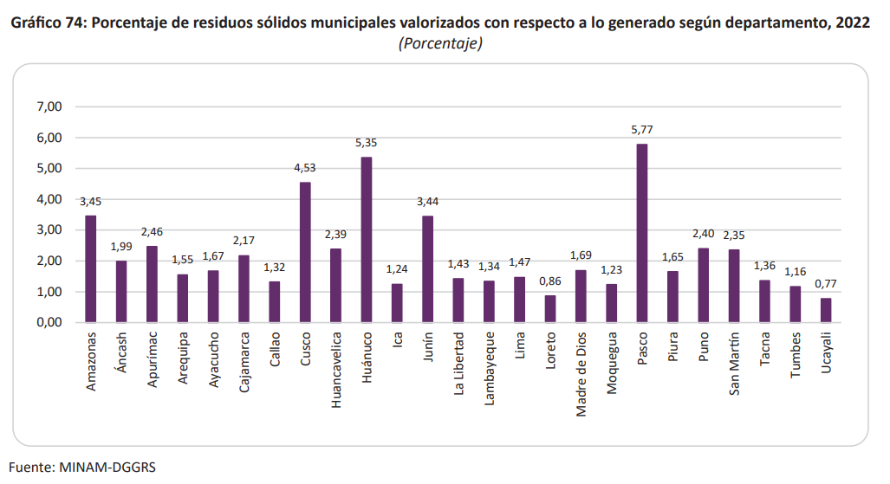

Nota.*Adaptado de Anuario estadístico del sector Ambiente 2023, por el Ministerio del Ambiente, 2023.*

Un estudio realizado en Madre de Dios mostró que el 35,4 % de los estudiantes tenía un nivel moderado de conciencia ambiental, el 28,7 % un nivel alto y solo el 7,2 % alcanzó un nivel muy alto, mientras que un 5,5 % se ubicó en un nivel muy bajo. Respecto a las actitudes proambientales, el 43,7 % presentó niveles parcialmente adecuados y apenas un 3,3 % logró niveles muy adecuados (Estrada, et al. 2022). 

**Figura 2**

*Resultados descriptivos de conciencia ambiental y las actitudes proambientales de los estudiantes de la Institución Educativa Almirante Miguel Grau Seminario de Madre de Dios, Perú.*

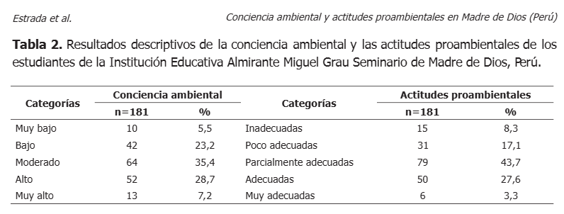

Nota. *Adaptado de Conciencia ambiental y actitudes proambientales en estudiantes de educación secundaria de Madre de Dios, Perú, por Estrada E., 2022.* 

### 1.2.2. Lean UX Process

#### *1.2.2.1. Lean UX Problem Statements*

El proyecto EcoMind propone una aplicación móvil educativa que promueve la conciencia ambiental en niños mediante retos interactivos y actividades familiares. A través de un diseño centrado en el usuario, inclusivo y gamificado, busca convertir el aprendizaje ecológico en una experiencia divertida y cotidiana. Su objetivo es integrar a padres e hijos en un entorno digital que fomente hábitos sostenibles y fortalezca el compromiso con el cuidado del planeta. 

Dentro de las escuelas primarias, se quiere que los estudiantes transformen la educación ambiental en hábitos sostenibles que se practiquen de manera constante en el hogar y la comunidad. no obstante, observamos que lo aprendido en el aula no cuenta con un proceso continuo y verificable que lo enlace con la rutina cotidiana, lo que se refleja en pocas eco acciones fuera de clase y baja permanencia en el tiempo. Aunque en la actualidad existen diversas plataformas y programas de educación ambiental y gamificación, identificamos que la continuidad, especialmente en el hogar y la comunidad, son débiles. Ahí radica la oportunidad que se desea aprovechar: intervenir en esa brecha de continuidad y verificación del comportamiento ambiental. Finalmente, todo ello ocurre bajo restricciones de tiempo pedagógico, brechas de conectividad y acceso a dispositivos. 

¿Como podríamos garantizar esa continuidad y acompañamiento entre escuela, hogar y comunidad, bajo dichas restricciones? 


#### *1.2.2.2. Lean UX Assumptions*

**Assumptions Worksheet**

1. ¿Quién es el usuario? 

Los usuarios principales son: 

Estudiantes de primaria (9–12 años): niños que inician la formación de hábitos ambientales y requieren actividades visuales, breves e interactivas para consolidar lo aprendido en la escuela.

Padres de familia de escolares de primaria: adultos responsables de reforzar y acompañar las prácticas sostenibles en el hogar, asegurando continuidad en las eco-acciones.

2. ¿Dónde encaja nuestro producto en su trabajo o vida? 

La aplicación se integra en la rutina de los escolares tanto en la escuela como en el hogar. Funciona como: 

Recurso educativo en el aula: apoyo a las clases de educación ambiental a través de actividades gamificadas.

Extensión en el hogar: plataforma para completar mini-retos familiares y dar seguimiento a las eco-acciones.

Conexión comunitaria: registro de actividades ambientales que trascienden el aula y se vinculan con la comunidad.

3. ¿Qué problemas tiene nuestro producto que resolver? 

En escolares de primaria: dificultad para trasladar lo aprendido en la escuela a la vida diaria, ya que los contenidos ambientales no siempre se refuerzan en casa o comunidad.

En padres de familia: falta de recursos y estrategias claras para apoyar a los niños en la práctica de hábitos sostenibles dentro del hogar.

En general: ausencia de retroalimentación y medición de impacto que permitan dar continuidad a las eco-acciones.

4. ¿Cuándo y cómo es usado nuestro producto? 

Durante las clases escolares, en sesiones que integren los contenidos ambientales.

En el hogar, como parte de tareas, eco-retos o proyectos familiares.

En la comunidad, registrando prácticas ambientales conjuntas.

El producto puede usarse en cualquier momento y lugar, tanto en modo online como en modo offline con sincronización diferida, asegurando continuidad incluso en contextos de baja conectividad.

5. ¿Qué características son importantes? 

Mini-retos y actividades progresivas adaptadas a escolares y familias.

Gamificación: puntos, insignias y rankings para incentivar la participación conjunta.

Retroalimentación inmediata con reportes visibles para niños y padres.

Modo offline con registro y posterior sincronización de actividades.

Interfaz visual, inclusiva y fácil de usar, adecuada para niños y adultos.

Reportes de impacto que midan el avance de eco-acciones individuales y colectivas.

6. ¿Cómo debería verse nuestro producto y cómo comportarse?

La aplicación debe presentar un diseño colorido, dinámico e intuitivo, con ilustraciones y personajes que conecten con los escolares y resulten comprensibles para los padres. La navegación debe ser clara, sencilla y atractiva, sin elementos que distraigan del aprendizaje.

En términos de funcionamiento, se espera que la plataforma sea ágil, responsiva y accesible, con tiempos de carga mínimos y transiciones fluidas. Debe comportarse como una experiencia de juego educativo con retroalimentación constante, transmitiendo confianza a las familias mediante reportes verificables de progreso e indicadores claros del impacto de las eco-acciones.

**Assumptions**

- Creo que mis clientes necesitan una plataforma educativa que integre escuela y hogar para reforzar la conciencia ambiental a través de actividades prácticas y gamificadas. 

- Estas necesidades se pueden resolver con mini-retos, eco-acciones verificables y reportes de impacto que motiven la continuidad de hábitos sostenibles. 

- Mis clientes iniciales son (o serán) escolares de primaria (9–12 años) y sus padres de familia, interesados en adoptar hábitos ambientales dentro y fuera del aula. 

- El valor #1 que un cliente quiere de mi servicio es la posibilidad de ver resultados tangibles en la formación de hábitos sostenibles en los niños. 

- El cliente también puede obtener estos beneficios adicionales: participación conjunta entre escuela y hogar, retroalimentación inmediata y reconocimiento familiar y comunitario. 

- Voy a adquirir la mayoría de mis clientes a través de instituciones educativas, programas ambientales escolares y difusión digital en redes sociales. 

- Haré dinero a través de un modelo freemium con acceso gratuito básico y una versión premium con funciones avanzadas de seguimiento e impacto. 

- Mi competencia principal en el mercado será aplicaciones educativas ambientales como Happy Little Planet o Defensor de la Naturaleza. 

- Los venceremos debido a nuestra propuesta integral que combina escuela, hogar y comunidad, con funcionalidad offline y un sistema de reportes verificables. 

- Mi mayor riesgo de producto es que las familias no utilicen la plataforma de manera constante fuera del aula. 

- Resolveremos esto a través de estrategias de gamificación, incentivos visibles (insignias, rankings) y actividades comunitarias que refuercen la continuidad. 

- ¿Qué otras suposiciones tenemos? Que las familias valorarán los reportes de impacto como evidencia de aprendizaje. Si esta suposición se prueba falsa, el proyecto podría tener baja adopción en los hogares. 

#### *1.2.2.3. Lean UX Hypothesis Statements*

**Hypothesis Statement 1**

Creemos que la implementación de actividades didácticas y gamificadas captará el interés de los niños para su contribución hacia el medio ambiente. Sabremos que lo hemos logrado, cuando al menos un 30% de los niños/estudiantes completen los mini-retos de forma semanal.

**Hypothesis Statement 2**

Creemos que añadir un modo offline permitirá acceso desde cualquier lugar y atraerá a nuevos usuarios de sectores o zonas de menos recursos. Sabremos que lo hemos logrado, cuando haya un incremento de 15% de usuarios que sean de zonas rurales o baja conectividad.

**Hypothesis Statement 3**

Creemos que incentivar a padres e hijos con actividades/mini-retos conjuntos harán que agreguen actividades eco-amigables dentro del hogar. Sabremos que lo hemos logrado, cuando al menos un 40% de las familias registradas complete/publique las actividades conjuntas que realizaron

**Hypothesis Statement 4**

Creemos que integrar un sistema de ranking motivara a los niños a una participación constante en las actividades. Sabremos que lo hemos logrado,cuando los niños aumenten en un 5% en tiempo/días de uso de la aplicación de forma mensual.

#### *1.2.2.4. Lean UX Canvas*

Link: https://canva.link/9mzenct40v5ocok

**Figura 3**

*Lean Product Canvas*

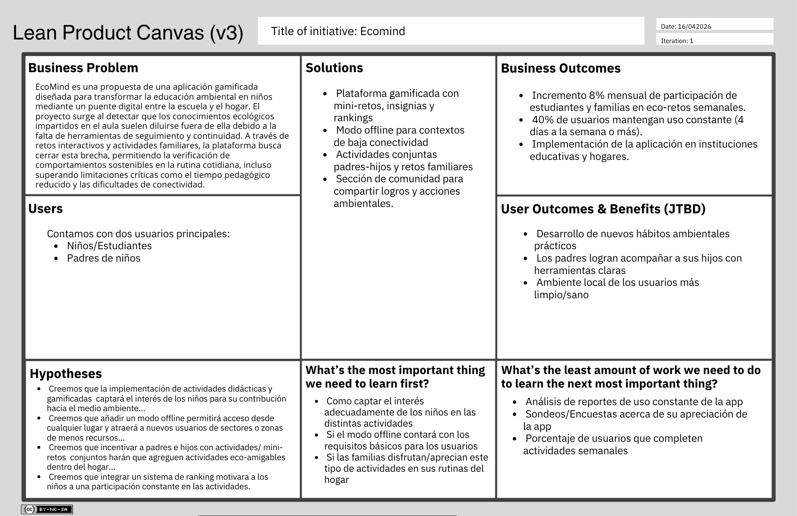

## 1.3. Segmentos objetivo

Los segmentos objetivo comprenden a los usuarios finales a los que nuestra solución busca atender. Para el caso de nuestra plataforma, se han determinado los siguientes perfiles prioritarios:

#### Segmento objetivo #1: Estudiantes de Primaria
Este segmento está constituido por niños y niñas en etapa escolar que se encuentran en una fase crucial para la formación de valores y hábitos sostenibles, y que requieren estímulos visuales y lúdicos para integrar el aprendizaje a su vida diaria.

**Aspectos demográficos:**
* Edad: 9 a 12 años.
* Género: Masculino y femenino.
* Nivel Educativo: Educación Primaria.
* Ubicación: Zonas urbanas y rurales.
* Nivel digital: Nativo digital; usuarios habituales de dispositivos móviles y tablets para juegos (como Roblox) y comunicación (Discord).

**Aspectos conductuales:**
Su aprendizaje es principalmente visual y práctico; prefieren aprender jugando, viendo videos o mediante retos interactivos. Se motivan con sistemas de recompensa y reconocimiento (puntos, insignias). Suelen conocer la teoría sobre el cuidado ambiental por la escuela, pero les cuesta aplicarla de forma constante en casa sin un incentivo o recordatorio dinámico.

**Información estadística de sustento:**
Para el segmento de estudiantes de primaria, las investigaciones indican que, si bien un 65.42% manifiesta una conciencia ambiental alta a nivel teórico, existe una brecha crítica en la práctica real, donde solo el 44.86% alcanza un nivel alto de sensibilidad emocional hacia el entorno (Bendezú, 2019).

**Necesidad:**
El estudiante requiere una experiencia de aprendizaje gamificada que convierta las tareas ecológicas (como reciclar o ahorrar agua) en "misiones" divertidas. Necesita una herramienta que le brinde retroalimentación inmediata sobre sus logros, permitiéndole ver el impacto real de sus acciones de manera sencilla y atractiva.

#### Segmento objetivo #2: Padres de Familia
Este segmento comprende a los adultos responsables del hogar, quienes actúan como el nexo principal para que los hábitos aprendidos en la escuela se consoliden en la rutina familiar cotidiana.
Aspectos demográficos:

* Edad: 30 a 62 años.
* Género: Masculino y femenino.
* Nivel Educativo: Superior técnica, universitaria o secundaria completa.
* Ubicación: Áreas residenciales y comunidades con acceso a servicios básicos.
* Nivel digital: Básico a intermedio; utilizan el celular para comunicación (WhatsApp), redes sociales y gestión laboral/bancaria.

**Aspectos conductuales:**
Valoran profundamente la educación ambiental como parte de la formación de sus hijos, pero enfrentan dificultades de tiempo o falta de estrategias claras para motivarlos. Buscan herramientas que sean seguras, educativas y que fomenten la unión familiar a través de actividades conjuntas.

**Información estadística de sustento:**
Respecto a los padres de familia, las investigaciones destacan que su involucramiento es fundamental, ya que el 72.53% de ellos logra adoptar hábitos sostenibles en el hogar tras la influencia de programas educativos ambientales iniciados por sus hijos (Taco et al., 2025).

**Necesidad:**
El padre de familia requiere una guía práctica y recursos simplificados (como guías o FAQs) para acompañar a sus hijos en el desarrollo de hábitos sostenibles. Necesita reportes de impacto y progreso que le den la seguridad de que sus hijos están aprendiendo de forma verificable, reforzando la conexión entre la escuela y el hogar.

# Capítulo II: Requirements Elicitation & Analysis

## 2.1. Competidores

#### 1. Defensor de la naturaleza  
Defensor de la naturaleza es una aplicación móvil educativa y ecológica dirigida a niños, orientada a fomentar la conciencia ambiental de manera lúdica y accesible. Lanzada por Y-Group Games, esta app ofrece una serie de minijuegos interactivos en los que los pequeños limpian jardines, parques y zonas de juego, plantan árboles y flores, clasifican residuos y limpian ríos y estanques contaminados. La experiencia está diseñada especialmente para enseñar a los niños la importancia de proteger la naturaleza y los entornos que los rodea. (Y-Group Games. (s. f.)  

#### 2. Happy Litle Planet  
Happy Little Planet es una aplicación educativa diseñada para niños, cuyo objetivo es enseñar hábitos sostenibles y el cuidado del medio ambiente de manera lúdica e interactiva. La app combina juegos educativos y libros con audio, proporcionando experiencias de aprendizaje divertidas y dinámicas que ayudan a los niños a comprender conceptos como reciclaje, ahorro de recursos y respeto por la naturaleza. (Adrilo Rincz, s.f.)   

#### 3. Earth Cubs  
Earth Cubs es una aplicación educativa orientada a niños, cuyo propósito es enseñar sobre el medio ambiente, la sostenibilidad y el cambio climático mediante experiencias lúdicas e interactivas. La app combina minijuegos, acertijos, cómics y videos, además de recursos para el aula, ofreciendo un aprendizaje dinámico que motiva a los más pequeños a desarrollar conciencia ambiental y hábitos responsables con la naturaleza. (Earth Cubs, s.f.)

### 2.1.1. Análisis competitivo

**Perfil**

|     | EcoMind | Defensor de la naturaleza | Happy Little plantet | Earth Cubs |
| --- | --- | --- | --- | --- |
| Logos |  |  | 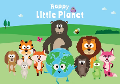 | 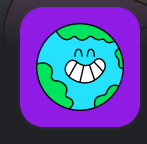 |
| Overview | Plataforma educativa gamificada que enseña hábitos sostenibles a escolares, con acceso online y offline, involucrando a familias y comunidades. | Juego móvil centrado en acciones ambientales directas en un entorno lúdico. | App educativa para niños que enseña hábitos sostenibles y cuidado ambiental mediante juegos interactivos y libros con audio, con acompañamiento de padres. | App educativa gamificada que enseña a los niños sobre el medio ambiente, sostenibilidad y cambio climático a través de minijuegos, acertijos, comics y recursos escolares. |
| Ventaja competitiva | Plataforma inclusiva con acceso online y offline. | Educación ambiental sencilla y entretenida para primeras edades. | Aprendizaje ambiental lúdico y seguro para primeras edades, con participación de los padres y contenido offline. | Contenidos educativos integrales y con impacto real. |

**Perfil de marketing**

|     | EcoMind | Defensor de la naturaleza | Happy Little plantet | Earth Cubs |
| --- | --- | --- | --- | --- |
| Mercado Objetivo | Niños escolares y padres de familia interesados en el cuidado ambiental. | Niños pequeños en la edad preescolar y primaria inicial. | Niños pequeños y padres interesados en educación ambiental. | Niños de nivel preescolar y primarios y sus padres / educadores. |
| Estrategias de Marketing | Promoción en redes sociales. | Promoción en tiendas de apps y atractivo visual infantil. | Promoción en tiendas de apps y blogs/redes sobre educación infantil; atractivo visual y seguro para niños. | Difusión multiplataforma y colaboraciones con escuelas y asociaciones ambientales   |

**Perfil de producto**

|     | EcoMind | Defensor de la naturaleza | Happy Little plantet | Earth Cubs |
| --- | --- | --- | --- | --- |
| Productos y Servicios | Plataforma gamificada con mini retos y juegos educativos. | App móvil con minijuegos ecológicos interactivos. | Juegos interactivos educativos, audiolibros, contenido descargable para uso offline. | Plataforma digital con juegos, videos y recursos educativos. |
| Precios y costos | Gratuita, con suscripciones y microtransacciones. | Gratuita con anuncios. | Gratuita. | App gratuita con acceso a contenidos basicos. |
| Canales de distribución (Web y/o móvil) | Web, app móvil y acceso offline. | App móvil (Google play). | App móvil         (Google Play, App Store) y web oficial. | Web official y apps móviles (App Store, Google play). |

**Análisis SWOT**

|     | EcoMind | Defensor de la naturaleza | Happy Little plantet | Earth Cubs |
| --- | --- | --- | --- | --- |
| Fortalezas | Gamificación que motiva a los jugadores y acceso online y offline. | Juego simple, divertido y accesible para niños pequeños. | Conecta lo digital con acciones reales de conversión. | Combina diversión con educación ambiental y amplia variedad de contenidos. |
| Debilidades | Requiere inversión constante en desarrollo de juegos. | Contenido limitado y depende de la publicidad. | Contenido limitado y poca interactividad social entre usuarios. | Enfoque amplio, y depende de actualizaciones constantes. |
| Oportunidades | Creciente interés en educación ambiental. | Creciente interés en apps educativas ecológicas. | Expansión a edades mayores o contenidos multijugador. | Integración de más contenidos ambientales en su plataforma global. |
| Amenazas | Competencia de apps educativas consolidadas. | Alta competencia de apps educativas similares. | Necesidad de actualizaciones frecuentes y alta competitividad. | Riesgo a quedas rasgada frente a plataformas digitales más innovadoras. |

### 2.1.2. Estrategias y tácticas frente a competidores

#### Estrategias

1. **Acceso inclusivo y continuidad**  
   ECOMIND funcionará tanto online como offline, asegurando que los escolares puedan seguir aprendiendo y realizando actividades educativas incluso en zonas con conectividad limitada o desde sus hogares.

2. **Gamificación y personalización mediante tecnología**  
   La plataforma incorporará gamificación avanzada para el seguimiento del progreso y recomendaciones automáticas. Esto permitirá personalizar el aprendizaje y mantener el interés de los usuarios.

#### Tácticas

#### Desarrollo de contenido hiperlocalizado  
Creación de retos, misiones y juegos basados en situaciones reales, con énfasis en acciones concretas de cuidado ambiental que los escolares puedan aplicar en su entorno.

#### Gamificación con incentivos y seguimiento  
Implementación de puntos, medallas, niveles y rankings para motivar a los niños. Además, los padres podrán acceder a reportes de progreso, reforzando el aprendizaje y fomentando hábitos sostenibles.

#### Aprovechamiento de debilidades de la competencia

1. **Frente a Defensor de la Naturaleza**  
   Dado que su experiencia es limitada y depende de publicidad para financiar el contenido, ECOMIND ofrecerá contenido más completo y libre de anuncios, garantizando aprendizaje continuo y mayor motivación de los usuarios.
   

## 2.2. Entrevistas

### 2.2.1. Diseño de entrevistas

**Escolares de primaria:**

1. ¿Cuál es tu nombre y cuántos años tienes? 

2. ¿Qué cosas te gusta hacer en tu tiempo libre? 

3. ¿Usas celular, Tablet o computadora? ¿Qué aplicaciones te gustan más? 

4. ¿Has aprendido en tu colegio algo sobre el cuidado del medio ambiente? ¿Qué es lo que más recuerdas? 

5. ¿Qué cosas haces tú en casa para ayudar al planeta? (ejemplo: separar basura, ahorrar agua, apagar luces).

6. ¿Qué es lo que más te divierte o motiva a hacerlo? 

7. Si pudieras aprender con juegos o retos sobre cómo cuidar el medio ambiente, ¿te gustaría? ¿Por qué? 

8. ¿Prefieres usar una aplicación en celular/Tablet o prefieres actividades en papel? ¿Por qué? 

9. ¿Cómo te gusta aprender más? ¿Jugando, viendo videos, ¿leyendo o escuchando? 

**Padres de familia:**

1. ¿Podría contarme un poco de usted? (edad, ocupación, hijos, lugar de residencia). 

2. ¿Qué nivel de confianza tiene en el uso de celulares o aplicaciones?

3. ¿Qué actividades suelen realizar en familia durante la semana? 

4. ¿Qué importancia le da al tema del cuidado del medio ambiente en la educación de sus hijos? 

5. ¿Qué acciones realizan en casa relacionadas con el medio ambiente? 

6. ¿Con qué dificultades se encuentran al intentar enseñar hábitos sostenibles en casa? 

7. Si existiera una aplicación con retos simples para que sus hijos aprendan y practiquen acciones ambientales, ¿la usaría en familia? ¿Por qué sí o por qué no? 

8. ¿Qué cosas le ayudarían a usted a motivar más a sus hijos en este tema? 

9. ¿Qué espera que su hijo logre aprender en los próximos años sobre el medio ambiente? 

### 2.2.2. Registro de entrevistas

**Video de la entrevista** :

https://upcedupe-my.sharepoint.com/:v:/g/personal/u20241e158_upc_edu_pe/IQAc74hewuNHToZcDklOaDB9AXfXi86jJbeHQm1dYv3cQZY?e=jNMFmH

#### Segmento: Padres de Familia
<br>

| **Entrevista No. 1** |
|---|
|  |
| **Entrevistado N°1:** Pedro Eulogio Pablo<br> **Edad:** 48 años<br>**Ubicación:** Barranca, Barranca, Lima<br><br> **Entrevista:** <br>**Instante del que inicia:** 0:00<br> **Duración:** 4:34<br><br> **Resumen:** <br><br>Nuestro entrevistado es Pedro Eulogio Pablo, un padre de familia de 48 años que vive en Barranca, región Lima. Tiene dos hijos de 9 y 15 años, quienes acompañan cursos en primaria y secundaria. Su rutina semanal se centra en el trabajo y en el acompañamiento a sus hijos en sus estudios, dedicando las tardes a comprender y revisar sus clases.<br><br>En cuanto al uso de la tecnología, Pedro tiene un nivel básico, ya que utiliza principalmente su celular para llamadas y WhatsApp. En contraste, sus hijos emplean aplicaciones más sofisticadas, acceso a redes sociales. Respecto al medio de la familia, Pedro le otorga gran importancia dentro de la educación familiar. En sus acciones más comunes son el reciclaje, la correcta disposición de los desechos y la limpieza de los espacios. Sin embargo, enfrenta dificultades porque sus hijos a veces olvidan prácticas básicas, como correr los caños o apagar las luces.<br><br>Para mejorar sus prácticas ambientales, Pedro está dispuesto a utilizar una aplicación con retos simples y premios que incentiven a que sus hijos realicen actividades cotidianas que les son importantes. A partir de la información que nos proporciona, hemos identificado que los hijos no solo practican en casa, sino que también comparten estas prácticas con su comunidad, creando autónomos en torno a los incentivos. |


| **Entrevista No. 2** |
|---|
|  |
| **Entrevistado N°2:** César Meléndez Romero<br> **Edad:** 62 años<br>**Ubicación:** Independencia, Lima<br><br> **Entrevista:** <br>**Instante del que inicia:** 4:55<br> **Duración:** 5:13<br><br> **Resumen:** <br><br>Nuestro entrevistado es César, un profesor de 62 años que vive en Independencia y cuenta con 1 hijo. La rutina semanal de César se centra en sus clases, y la entrevista aborda la importancia del cuidado del medio ambiente y el uso de una aplicación educativa para este propósito.<br><br>En cuanto al uso de la tecnología, César tiene un conocimiento básico, ya que se siente confiado en su capacidad para usar un teléfono celular y aplicaciones. Respecto al cuidado del medio ambiente, le otorga gran importancia, especialmente con los problemas actuales como las sequías. En su hogar, las acciones más comunes son gestionar el consumo de agua y evitar materiales que emitan gases de efecto invernadero. Sin embargo, enfrenta dificultades porque la gente no es plenamente consciente de la importancia de estas acciones.<br><br>César considera que el apoyo de la tecnología puede ser clave para motivar a su familia. Estaría dispuesto a utilizar una aplicación con retos simples para enseñar acciones ambientales a sus hijos. Para él, lo más importante es que sus hijos valoren y preserven un medio ambiente saludable para el futuro. |


| **Entrevista Nro. 3** |
|---|
| |
| **Entrevistado N°3:** Juan Carlos Huamán Quispe<br> **Edad:** 30 años<br>**Ubicación:** San Juan de Lurigancho, Lima<br><br> **Entrevista:** <br>**Instante del que inicia:** 3:12<br> **Duración:** 4:35<br><br> **Resumen:** <br><br>Nuestro entrevistado es Juan Carlos Huamán Quispe, un padre de familia de 30 años que vive en San Juan de Lurigancho, Lima. Tiene dos hijos de 8 y 3 años, quienes actualmente cursan primaria e inicial. Su rutina semanal combina su trabajo como contador con el acompañamiento a sus hijos, dedicando las noches y fines de semana a compartir actividades familiares.<br><br>En cuanto al uso de la tecnología, Juan Carlos tiene un nivel intermedio, ya que utiliza el celular para llamadas, WhatsApp, correo y aplicaciones bancarias, aunque suele pedir ayuda para instalar o configurar nuevas aplicaciones. Respecto al cuidado del medio ambiente, considera que es un aspecto fundamental en la educación de sus hijos. En su hogar, las acciones más comunes son el reciclaje, el uso de bolsas reutilizables y el ahorro de agua y energía. Sin embargo, enfrenta dificultades porque sus hijos a veces olvidan apagar las luces o colocar la basura en el tacho adecuado.<br><br>Juan Carlos afirma que utilizaría una aplicación con retos ambientales, pues cree que sus hijos aprenden más rápido con dinámicas lúdicas y competitivas. Considera que la motivación se refuerza cuando la escuela y la familia trabajan de la mano, y que los incentivos o pequeños logros ayudan a mantener el interés de los niños. Finalmente, espera que sus hijos aprendan a ser responsables con el medio ambiente, valorando la naturaleza y entendiendo que cada acción, por pequeña que sea, puede marcar la diferencia en su comunidad. |


#### Segmento objetivo: Escolares de Primaria
<br>

| **Entrevista Nro. 1** |
|---|
| 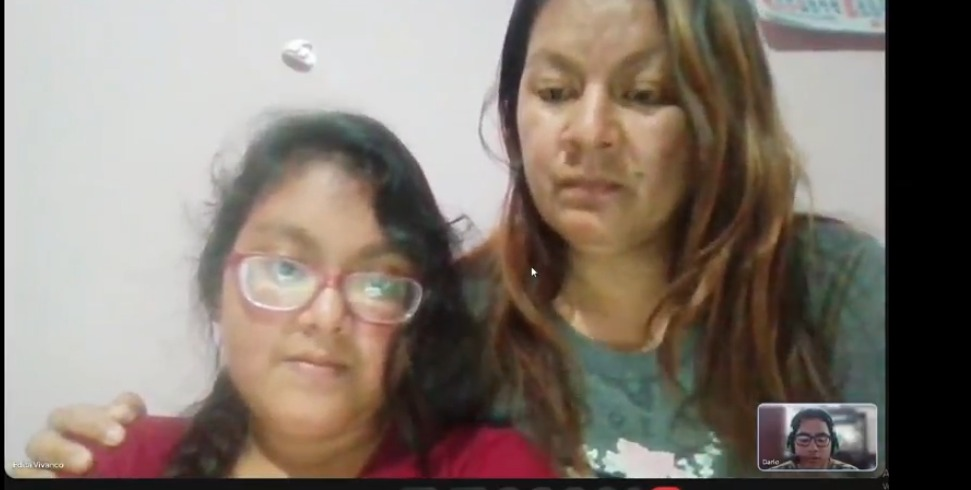 |
| **Entrevistado N°1:** Mia Rivera Vivanco Zárate<br> **Edad:** 10 años<br>**Ubicación:** Surquillo, Lima<br><br> **Entrevista:** <br>**Instante del que inicia:** 15:17<br> **Duración:** 4:35<br><br> **Resumen:** <br><br>Nuestra entrevistada es Mia Antonela Rivera Vivanco, una niña de 10 años que actualmente es estudiante de nivel primaria, junto a su madre, Erita Vivanco Zárate.<br><br>En cuanto al uso de la tecnología, utiliza su celular y computadora. Sus aplicaciones favoritas son Pinterest y Roblox, ya que le permiten interactuar con amigos que viven lejos. Para aprender sobre el cuidado del medio ambiente, prefiere juegos y videos porque son más entretenidos. Respecto al cuidado del medio ambiente, recuerda que en su colegio le enseñaron que la contaminación puede afectar a la comunidad en el futuro. En casa, sus acciones más comunes son ahorrar agua y apagar las luces durante el día para aprovechar la luz natural.<br><br>Lo que la motiva a cuidar el planeta es el deseo de que en el futuro siga siendo como lo conocemos hoy y no se convierta en un lugar peor. Prefiere actividades en papel sobre las digitales porque puede reutilizarlas. |

| **Entrevista Nro. 2** |
|---|
| 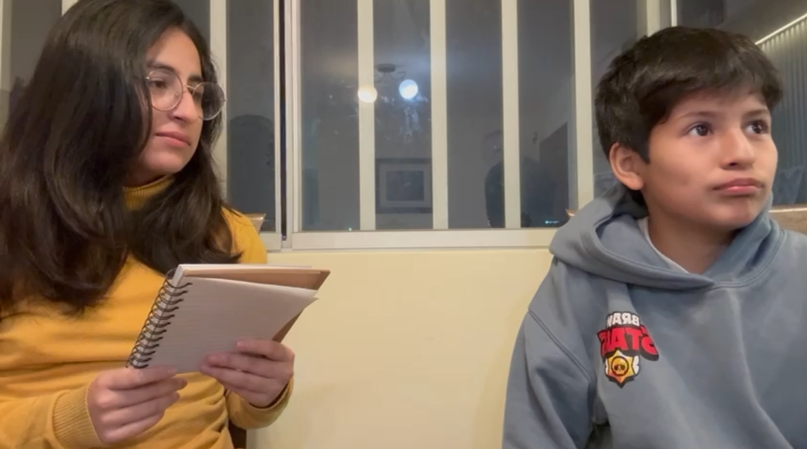 |
| **Entrevistado N°2:** Pablo Astocondor<br> **Edad:** 11 años<br>**Ubicación:** Pueblo Libre, Lima<br><br> **Entrevista:** <br>**Instante del que inicia:** 19:51<br> **Duración:** 3:15<br><br> **Resumen:** <br><br>Nuestro entrevistado es Pablo, un estudiante de 11 años. En su tiempo libre le gusta jugar con sus juguetes, salir, utilizar la consola o la PC, y también emplear aplicaciones como Roblox para jugar y Discord para comunicarse.<br><br>En relación con el cuidado del medio ambiente, recuerda que en su colegio le han enseñado sobre el ahorro de agua, no botar botellas y guardar chapas. En su casa procura no usar muchas bolsas de plástico. Lo que más lo motiva es haber visto en la provincia la acumulación de basura y cómo afecta tanto a las personas como a los animales, lo que lo hace reflexionar sobre la importancia de reducir los desechos.<br><br>Sobre la forma de aprender, señala que prefiere actividades digitales, aunque también reconoce el valor de las que son en papel. Le gusta aprender escuchando, viendo videos y leyendo textos cortos. Además, considera que los juegos pueden servir como herramienta de aprendizaje si tienen mecánicas bien diseñadas, aunque algunos pueden resultar adictivos.<br><br>Finalmente, Pablo demuestra que disfruta combinar distintas formas de aprendizaje y entretenimiento, mostrando una postura crítica frente al uso de videojuegos educativos. |

| **Entrevista Nro. 3** |
|---|
| 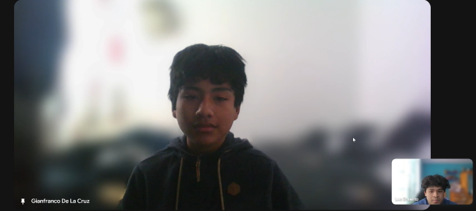 |
| **Entrevistado N°3:** Gianfranco de la Cruz <br> **Edad:** 12 años<br>**Ubicación:** La Molina, Lima<br><br> **Entrevista:** <br>**Instante del que inicia:** 23:06<br> **Duración:** 3:40<br><br> **Resumen:** <br><br>El entrevistado se llama Gianfranco de la Cruz, tiene 12 años y está por culminar la primaria. Le gusta pasar el tiempo usando su celular, ya sea para jugar o ver videos.<br><br>Nos menciona que en su colegio sí le han enseñado de manera regular sobre el cuidado del ambiente, como la implementación de tachos de basura específicos para reciclaje. Sin embargo, fuera del colegio no tiene muy claro qué actividades o acciones puede realizar, aparte de mantener limpias sus zonas de convivencia.<br><br>Por último, menciona que actualmente realiza este tipo de acciones más por ayudar que por motivación propia. Sin embargo, la idea de aprender nuevas formas de apoyo mediante juegos o videos le parecería motivante para esforzarse más. |


### 2.2.3. Análisis de entrevistas

**Segmento: Padres de familia**

**1. Perfil general (edad, ocupación, hijos, residencia):**

* Edad promedio: 47 años (48, 62 y 30).
* Todos tienen hijos en edad escolar (inicial, primaria y secundaria).
* Viven en Lima Metropolitana y Barranca.
     
**2. Nivel de confianza con tecnología (celulares/aplicaciones)**

**Figura 3**

*Nivel de confianza en la tecnología - Padres*

 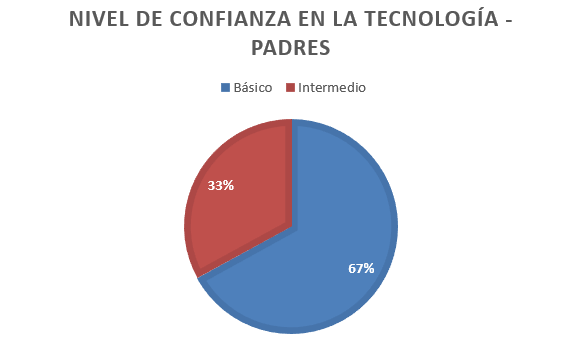 
 
**3. Actividades familiares durante la semana:**

En relación con las actividades familiares, los padres señalaron que durante la semana revisan clases y tareas con sus hijos, conversan en las tardes y comparten más tiempo durante los fines de semana.

**4. Importancia del medio ambiente en la educación de los hijos:**

Sobre la importancia del medio ambiente en la educación de sus hijos, el 100% de los entrevistados lo considera fundamental, asociándolo con problemas actuales como sequías, contaminación y el exceso de desechos.

**5. Acciones ambientales realizadas en casa**

En cuanto a las acciones ambientales realizadas en casa, todos afirmaron practicar el ahorro de agua y energía. Además, realizan reciclaje y utilizan bolsas reutilizables o deposita correctamente los desechos.

**6. Dificultades al enseñar hábitos sostenibles a los hijos**

**Figura 4**

*Dificultades en las enseñanzas - Padres*

 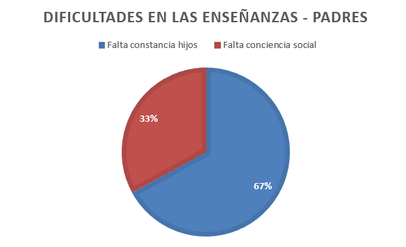 
 
**7. Aplicaciones educativas Ambientales**

Frente al uso de aplicaciones educativas ambientales, todos los padres estarían dispuestos a utilizarlas, siempre que sean prácticas y sencillas. 

**8. Motivación para los hijos**

En cuanto a la motivación de los hijos, los padres mencionaron que responden mejor cuando hay premios y logros visibles, dinámicas familiares o cuando sienten que sus acciones tienen un impacto en la comunidad.

**9. Expectativas de aprendizaje ambiental:**

Con respecto a las expectativas de aprendizaje ambiental, los padres desean que sus hijos asuman responsabilidades tanto en el hogar como en la comunidad, y que desarrollen una conciencia crítica frente al consumo de agua, energía y residuos.

**Segmento: Escolares de primaria:**

**1. Perfil general (nombre, edad, residencia):**
* Edad promedio: 11 años (10, 11 y 12).
* Residentes en Lima (Pueblo Libre, La Molina, San Juan de Lurigancho).
  
**2. Actividades en tiempo libre:**

Respecto a sus actividades en el tiempo libre, los escolares disfrutan jugar en consola o computadora, pasar tiempo en plataformas digitales

**Figura 5**

*Apps favoritas de escolares de primaria*

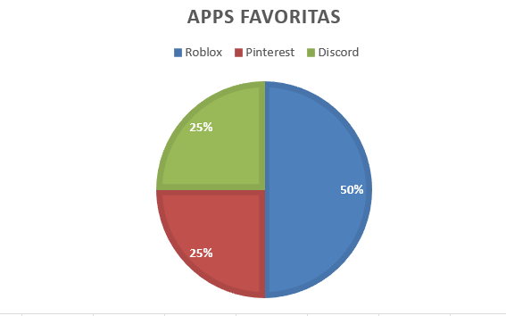 

**Figura 6**

Uso de aparatos tecnológicos- Escolares

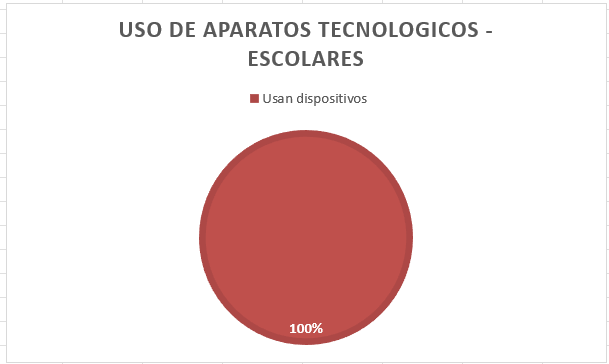 
 
**4. Aprendizaje escolar sobre medio ambiente:**

Sobre el aprendizaje escolar en temas ambientales, los niños identificaron prácticas como el ahorro de agua y energía, la separación de basura, la reducción de plásticos y la conciencia frente a la contaminación futura.

**5. Acciones ambientales en casa:**

Dentro de las acciones ambientales en casa practican apagar luces y ahorrar agua, otro practica el reciclaje o la reducción de bolsas plásticas, y también se enfocan en mantener limpio su espacio,

**6. Motivación para hacerlo:**

**Figura 7**

*Motivación de escolares*

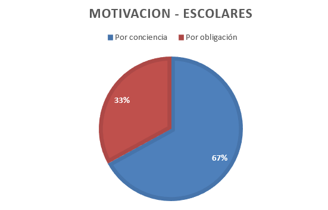
 
**7. Aprender con juegos o retos**

**Figura 8**
*Juegos educativos - Escolares*

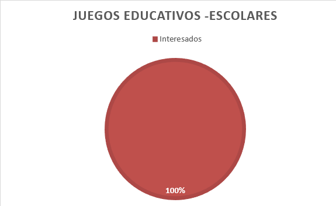 
 
**8. Preferencias entre lo digital o papel**

**Figura 9**

*Preferencia en los escolares*

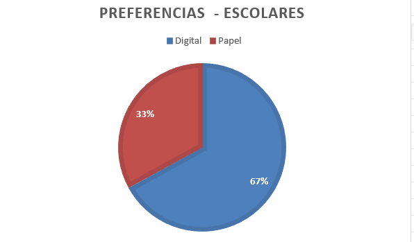 
  
**9. Forma de aprender favorita**

En cuanto a la forma de aprender, todos mostraron interés en juegos y retos relacionados con el medio ambiente.

**Análisis comparativo**

El análisis de entrevistas evidencia una diferencia clara en el nivel de confianza tecnológica entre padres e hijos. Mientras que los padres presentan un manejo básico o intermedio, lo que implica la necesidad de aplicaciones simples y fáciles de usar, los escolares muestran un dominio más alto de dispositivos y plataformas digitales, lo que refleja una motivación clara hacia el aprendizaje mediante entornos digitales.

En cuanto a la educación ambiental, los padres perciben este aspecto como una responsabilidad tanto familiar como comunitaria, asociándolo a prácticas de ahorro y reciclaje en el hogar. Por su parte, los hijos lo relacionan más directamente con el futuro y con su entorno inmediato, mostrando interés en acciones como el cuidado del agua, la energía y la reducción de plásticos. Sin embargo, ambos segmentos comparten limitaciones que deben considerarse. Los padres enfrentan la falta de constancia de sus hijos al mantener hábitos sostenibles, así como una escasa conciencia comunitaria. 

En el caso de los escolares, algunos presentan una motivación débil al asumir estas prácticas y existe el riesgo de que las aplicaciones o juegos se vuelvan adictivos si no se diseñan adecuadamente. Frente a este panorama, se identifica una oportunidad clara para el desarrollo de una aplicación educativa ambiental con retos sencillos, dinámicos e incentivados que fortalezcan el vínculo entre familia y la conciencia ambiental.

## 2.3. Needfinding

### 2.3.1. User Personas
**Primer Segmento Objetivo (Padres de Familia)**

*Figura 4 (User Persona 1)*  
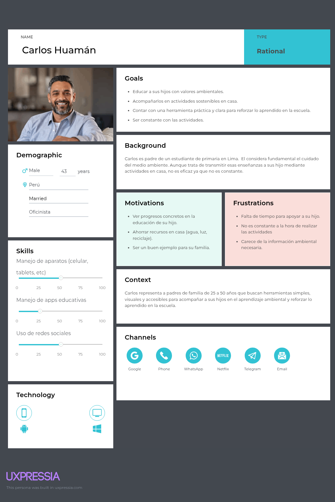

**Segundo Segmento Objetivo (Escolares de primaria)**

*Figura 5 (User Persona 2)*  
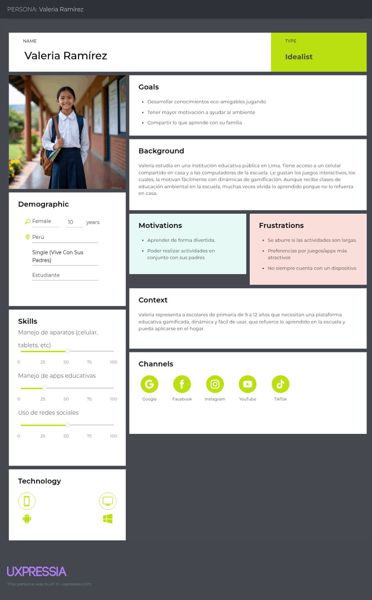

### 2.3.2. User Task Matrix
**Primer Segmento Objetivo (Padres de Familia)**

*Figura 6 (User Task Matrix 1)*  
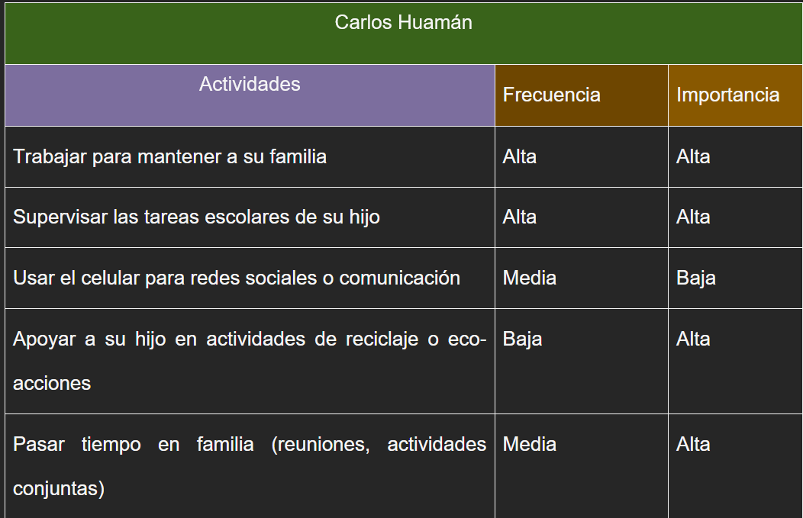

**Segundo Segmento Objetivo (Escolares de primaria)**

*Figura 7 (User Task Matrix 2)*  
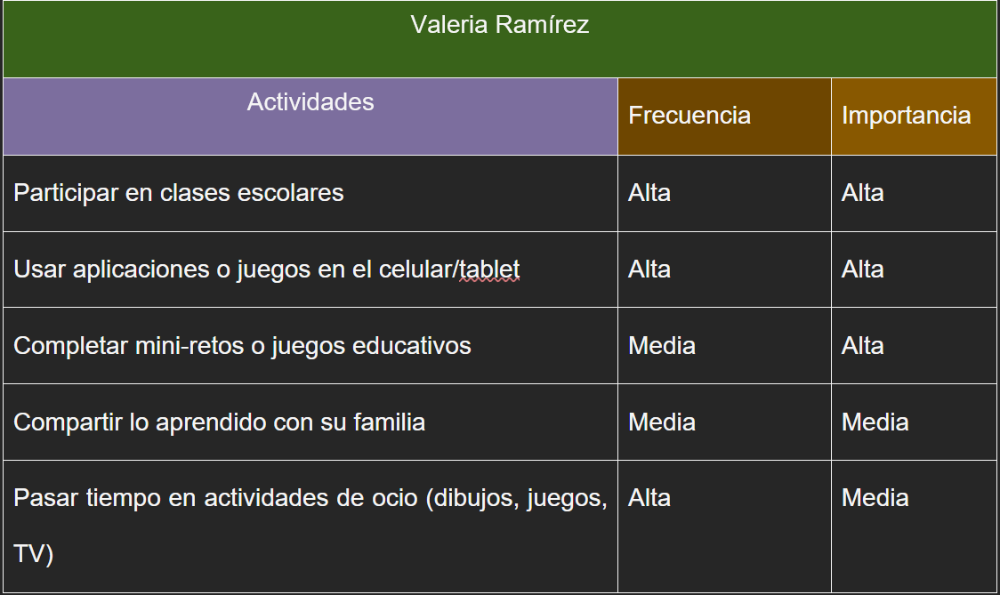


### 2.3.3. User Journey Mapping
**Primer Segmento Objetivo (Padres de Familia)**

*Figura 8 (User Journey Mapping 1)*  
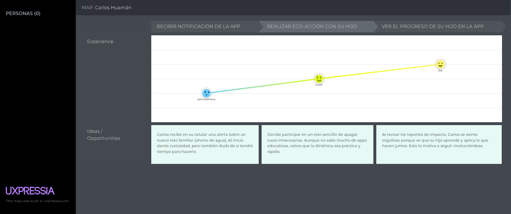

**Segundo Segmento Objetivo (Escolares de primaria)**

*Figura 9 (User Journey Mapping 2)*  
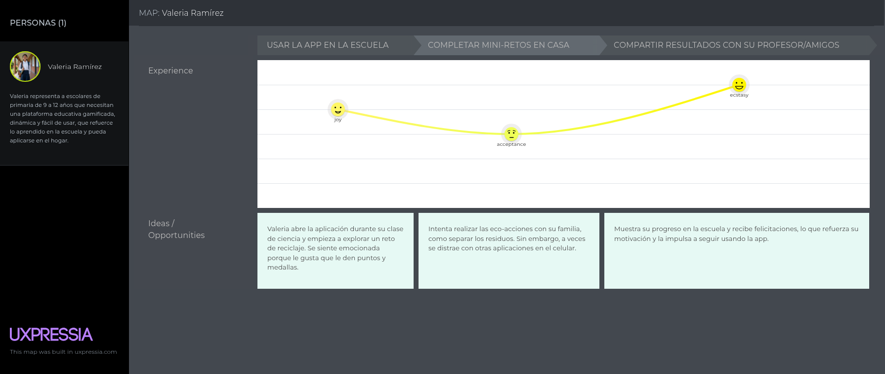

### 2.3.4. Empathy Mapping
**Primer Segmento Objetivo (Padres de Familia)**

*Figura 10 (Empathy Mapping 1)*  
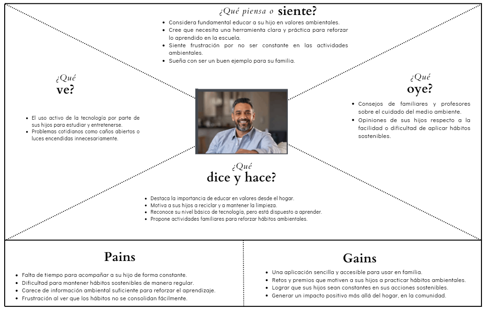

**Segundo Segmento Objetivo (Escolares de primaria)**

*Figura 11 (Empathy Mapping 2)*  
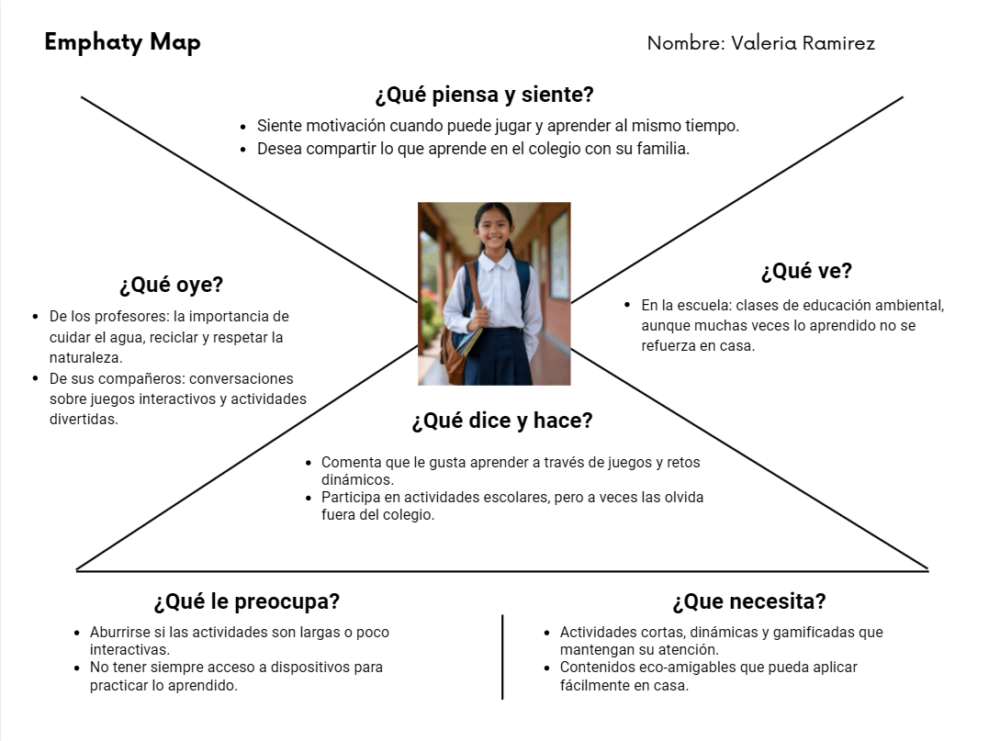

## 2.4. Big Picture EventStorming


## 2.5. Ubiquitous Language
El siguiente glosario define los términos clave del dominio de negocio utilizados en EcoMind. Estos conceptos permiten que todos los miembros del equipo y stakeholders compartan una comprensión común, evitando ambigüedades y facilitando la comunicación.

Los términos se presentan en inglés, acompañados de su equivalente en español.

*Glosario del Dominio*

- **User**(Usuario)
Persona que interactúa con la plataforma. Se clasifica principalmente en estudiantes y padres de familia, quienes cumplen roles complementarios.
- **Streak**(Racha) 
  Registro de días consecutivos en que el usuario (estudiante/padre de familia) ingresa y completa sus actividades. Al alcanzar un periodo determinado (por ejemplo, 7 días), se otorga un bono de puntos incremental para reforzar la constancia.
- **Ranking**(Ranking)  
  Tabla que ordena a estudiantes o familias según los puntos acumulados. Solo participan aquellos que hayan completado al menos una actividad en el periodo evaluado.
- **Commitment**(Compromiso)  
  Declaración personal registrada por el usuario en su perfil, donde expresa su intención de mantener un hábito ambiental específico. Puede ser editada o eliminada por el usuario.
- **Challenge**(Reto) 
  Actividad propuesta por la plataforma que impulsa la realización de una eco-acción. Puede desarrollarse de manera individual, familiar o comunitaria.
- **Points**(Puntos)  
  Unidad de reconocimiento otorgada al completar actividades. Se acumulan en el perfil del usuario y determinan su posición en el ranking.
- **Badge**(Insignia)  
  Representación visual de un logro alcanzado por el usuario, utilizada como incentivo y reconocimiento dentro del sistema.
- **Community**(Comunidad)  
  Espacio donde los usuarios comparten logros, interactúan y participan en actividades colectivas, fomentando la motivación social.
- **Offline Mode**(Modo Offline)  
  Funcionalidad que permite realizar y registrar actividades sin conexión a internet. Los datos se sincronizan cuando se restablece la conectividad.
- **Dashboard**(Panel de Control) 
  Vista principal donde el usuario puede visualizar su progreso, puntos acumulados, retos completados y métricas de impacto de forma clara y resumida.
- **Frequently Asked Questions** - FAQ (Preguntas Frecuentes)  
  Sección informativa que responde dudas comunes de los usuarios sobre el uso de la plataforma, actividades y objetivos ambientales.
- **Environmental Awareness**(Conciencia Ambiental)  
  Nivel de conocimientos, actitudes y prácticas que permiten a una persona actuar de manera responsable con el entorno.
- **Eco-Action** (Eco-Acción) 
  Acción concreta y verificable realizada fuera de la aplicación que contribuye al cuidado del medio ambiente.
- **Sustainable Habit**  (Hábito Sostenible)  
  Práctica repetitiva incorporada en la vida diaria del usuario, como resultado del uso continuo de la plataforma.
- **Gamification** (Gamificación)
Estrategia que utiliza elementos de juego para hacer el aprendizaje más atractivo, dinámico y motivador.
- **Progress** (Progreso)
  Medida del avance del usuario en la realización de retos y eco-acciones. Permite visualizar la evolución del aprendizaje.


# Capítulo III: Requirements Specification

## 3.1. User Stories

### Épicas

<table align="center">
  <tr>
    <td align="center"><b>Epic ID</b></td>
    <td align="center"><b>Título</b></td>
    <td align="center"><b>Descripción</b></td>
  </tr>
  <tr>
    <td align="center"><b>EP01</b></td>
    <td align="center">Actividades gamificadas</td>
    <td>Como estudiante, quiero acceder a actividades gamificadas sobre cuidado ambiental, para aprender de forma entretenida y mantener mi interés en el tema.</td>
  </tr>
  <tr>
    <td align="center"><b>EP02</b></td>
    <td align="center">Participación familiar</td>
    <td>Como padre, quiero que la aplicación ofrezca actividades y proyectos grupales, para fortalecer la interacción, colaboración y aprendizaje dentro de mi familia.</td>
  </tr>
  <tr>
    <td align="center"><b>EP03</b></td>
    <td align="center">Información clara y amigable</td>
    <td>Como estudiante, quiero acceder a información sencilla y fácil de comprender sobre las actividades, para aprender sin perder la motivación.</td>
  </tr>
  <tr>
    <td align="center"><b>EP04</b></td>
    <td align="center">Acceso a comunidad</td>
    <td>Como estudiante, quiero una sección que me permita interactuar con otros usuarios y compartir logros, para sentir motivación en mejorar continuamente.</td>
  </tr>
  <tr>
    <td align="center"><b>EP05</b></td>
    <td align="center">Accesibilidad</td>
    <td>Como estudiante o padre, quiero que la aplicación funcione de manera rápida, sencilla y accesible en cualquier dispositivo, para contar con una experiencia fluida y agradable en cualquier situación.</td>
  </tr>
  <tr>
    <td align="center"><b>EP06</b></td>
    <td align="center">Landing page informativa</td>
    <td>Como estudiante o padre, quiero acceder a una página informativa de EcoMind, para conocer la propuesta del producto y unirme a la comunidad.</td>
  </tr>
  <tr>
    <td align="center"><b>EP07</b></td>
    <td align="center">Backend – Gestión de Usuarios y Autenticación</td>
    <td>Como equipo de desarrollo, necesitamos implementar los servicios de autenticación, registro y gestión de perfiles para soportar el acceso seguro a la plataforma.</td>
  </tr>
  <tr>
    <td align="center"><b>EP08</b></td>
    <td align="center">Backend – Gestión de Retos y Progreso</td>
    <td>Como equipo de desarrollo, necesitamos implementar los endpoints para la gestión de retos, puntajes e insignias, para soportar las funcionalidades gamificadas de la plataforma.</td>
  </tr>
  <tr>
    <td align="center"><b>EP09</b></td>
    <td align="center">Backend – Sincronización y Disponibilidad</td>
    <td>Como equipo de desarrollo, necesitamos implementar la sincronización offline y garantizar la disponibilidad del sistema para soportar el acceso desde zonas con baja conectividad.</td>
  </tr>
</table>

---

### User Stories

<table align="center">
  <tr>
    <td><b>User Story ID</b></td><td>HU-001</td>
    <td><b>Epic ID</b></td><td>EP01</td>
  </tr>
  <tr>
    <td><b>Título</b></td>
    <td colspan="3">Miniactividad guiada con indicaciones</td>
  </tr>
  <tr>
    <td><b>Descripción</b></td>
    <td colspan="3">Como estudiante, quiero completar miniactividades guiadas con indicaciones claras, para aprender de forma entretenida dentro de la aplicación.</td>
  </tr>
  <tr>
    <td colspan="4">
      <b>Criterios de aceptación:</b><br/><br/>
      <b>Escenario 1:</b> Ver miniactividad<br/>
      <ul>
        <li><b>Dado que</b> el estudiante se encuentra en el menú principal,</li>
        <li><b>Cuando</b> elige una miniactividad,</li>
        <li><b>Entonces</b> la aplicación le muestra un resumen de la miniactividad.</li>
      </ul>
      <b>Escenario 2:</b> Iniciar miniactividad<br/>
      <ul>
        <li><b>Dado que</b> el estudiante está viendo una miniactividad,</li>
        <li><b>Cuando</b> elige "iniciar actividad",</li>
        <li><b>Entonces</b> la aplicación marca la miniactividad como activa,</li>
        <li><b>Y</b> muestra un mensaje motivador de inicio.</li>
      </ul>
      <b>Escenario 3:</b> Miniactividad completada correctamente<br/>
      <ul>
        <li><b>Dado que</b> el estudiante inicia una miniactividad y sigue todas las indicaciones mostradas en la pantalla,</li>
        <li><b>Cuando</b> registra que realizó cada paso correctamente,</li>
        <li><b>Entonces</b> la aplicación aprueba su trabajo,</li>
        <li><b>Y</b> muestra un mensaje motivador al finalizar.</li>
      </ul>
      <b>Escenario 4:</b> Miniactividad incompleta<br/>
      <ul>
        <li><b>Dado que</b> el estudiante inicia una miniactividad y omite algunas indicaciones,</li>
        <li><b>Cuando</b> el estudiante intenta finalizar la miniactividad,</li>
        <li><b>Entonces</b> la aplicación muestra un aviso,</li>
        <li><b>Y</b> sugiere al estudiante revisar los pasos que faltan.</li>
      </ul>
      <b>Escenario 5:</b> Eliminar miniactividad<br/>
      <ul>
        <li><b>Dado que</b> el estudiante se encuentra en la sección de actividades activas y elige una miniactividad,</li>
        <li><b>Cuando</b> selecciona "eliminar actividad" y confirma su selección,</li>
        <li><b>Entonces</b> el sistema elimina la miniactividad de las actividades activas del usuario.</li>
      </ul>
    </td>
  </tr>
</table>

---

<table align="center">
  <tr>
    <td><b>User Story ID</b></td><td>HU-002</td>
    <td><b>Epic ID</b></td><td>EP01</td>
  </tr>
  <tr>
    <td><b>Título</b></td>
    <td colspan="3">Reto ambiental diario</td>
  </tr>
  <tr>
    <td><b>Descripción</b></td>
    <td colspan="3">Como estudiante, quiero realizar un reto ambiental diario en casa o escuela, para aplicar lo aprendido fuera de la aplicación.</td>
  </tr>
  <tr>
    <td colspan="4">
      <b>Criterios de aceptación:</b><br/><br/>
      <b>Escenario 1:</b> Reto diario completado con éxito<br/>
      <ul>
        <li><b>Dado que</b> el estudiante realiza el reto diario y cumple las indicaciones establecidas,</li>
        <li><b>Cuando</b> registra su resultado,</li>
        <li><b>Entonces</b> la aplicación valida la acción,</li>
        <li><b>Y</b> muestra un reconocimiento visual o puntos obtenidos.</li>
      </ul>
      <b>Escenario 2:</b> Actualización del reto diario<br/>
      <ul>
        <li><b>Dado que</b> el estudiante no realiza el reto diario,</li>
        <li><b>Cuando</b> el tiempo establecido caduca,</li>
        <li><b>Entonces</b> la aplicación cambia el reto diario.</li>
      </ul>
    </td>
  </tr>
</table>

---

<table align="center">
  <tr>
    <td><b>User Story ID</b></td><td>HU-003</td>
    <td><b>Epic ID</b></td><td>EP01</td>
  </tr>
  <tr>
    <td><b>Título</b></td>
    <td colspan="3">Retroalimentación de actividades</td>
  </tr>
  <tr>
    <td><b>Descripción</b></td>
    <td colspan="3">Como estudiante, quiero recibir retroalimentación al finalizar una actividad, para saber en qué aspectos puedo mejorar.</td>
  </tr>
  <tr>
    <td colspan="4">
      <b>Criterios de aceptación:</b><br/><br/>
      <b>Escenario 1:</b> Retroalimentación de actividad<br/>
      <ul>
        <li><b>Dado que</b> el estudiante finaliza una actividad en la aplicación,</li>
        <li><b>Cuando</b> completa parcialmente los pasos o presenta errores,</li>
        <li><b>Entonces</b> la aplicación muestra recomendaciones claras sobre cómo mejorar.</li>
      </ul>
      <b>Escenario 2:</b> Falla en retroalimentación<br/>
      <ul>
        <li><b>Dado que</b> el estudiante recibe una retroalimentación,</li>
        <li><b>Cuando</b> oprime el botón de reportar,</li>
        <li><b>Entonces</b> la aplicación marca la recomendación.</li>
      </ul>
    </td>
  </tr>
</table>

---

<table align="center">
  <tr>
    <td><b>User Story ID</b></td><td>HU-004</td>
    <td><b>Epic ID</b></td><td>EP01</td>
  </tr>
  <tr>
    <td><b>Título</b></td>
    <td colspan="3">Sistema de puntos por aprendizaje</td>
  </tr>
  <tr>
    <td><b>Descripción</b></td>
    <td colspan="3">Como estudiante, quiero obtener puntos al completar actividades, para mantener mi motivación dentro de la aplicación.</td>
  </tr>
  <tr>
    <td colspan="4">
      <b>Criterios de aceptación:</b><br/><br/>
      <b>Escenario 1:</b> Puntos brindados exitosamente<br/>
      <ul>
        <li><b>Dado que</b> el estudiante culmina una actividad exitosamente,</li>
        <li><b>Entonces</b> el sistema le brindará el puntaje correspondiente a la actividad,</li>
        <li><b>Y</b> lo actualizará en el sistema.</li>
      </ul>
      <b>Escenario 2:</b> Problema en brindado de puntaje<br/>
      <ul>
        <li><b>Dado que</b> el estudiante culmina alguna actividad,</li>
        <li><b>Cuando</b> el sistema presenta un problema al asignar el puntaje,</li>
        <li><b>Entonces</b> el sistema mostrará un mensaje de error,</li>
        <li><b>Y</b> deshará la culminación de la actividad.</li>
      </ul>
    </td>
  </tr>
</table>

---

<table align="center">
  <tr>
    <td><b>User Story ID</b></td><td>HU-005</td>
    <td><b>Epic ID</b></td><td>EP01</td>
  </tr>
  <tr>
    <td><b>Título</b></td>
    <td colspan="3">Reconocimiento por constancia</td>
  </tr>
  <tr>
    <td><b>Descripción</b></td>
    <td colspan="3">Como estudiante, quiero recibir reconocimientos al completar varias actividades seguidas, para reforzar mi compromiso con el aprendizaje.</td>
  </tr>
  <tr>
    <td colspan="4">
      <b>Criterios de aceptación:</b><br/><br/>
      <b>Escenario 1:</b> Bono de puntos por constancia<br/>
      <ul>
        <li><b>Dado que</b> el estudiante entra de forma diaria a la aplicación y ha culminado exitosamente sus actividades,</li>
        <li><b>Cuando</b> llegue a 7 días seguidos,</li>
        <li><b>Entonces</b> el sistema le brindará un bono de puntos incremental por semana.</li>
      </ul>
    </td>
  </tr>
</table>

---

<table align="center">
  <tr>
    <td><b>User Story ID</b></td><td>HU-006</td>
    <td><b>Epic ID</b></td><td>EP01</td>
  </tr>
  <tr>
    <td><b>Título</b></td>
    <td colspan="3">Establecimiento de compromiso</td>
  </tr>
  <tr>
    <td><b>Descripción</b></td>
    <td colspan="3">Como estudiante, quiero establecer compromisos individuales, para mantenerme constante.</td>
  </tr>
  <tr>
    <td colspan="4">
      <b>Criterios de aceptación:</b><br/><br/>
      <b>Escenario 1:</b> Agregar compromisos<br/>
      <ul>
        <li><b>Dado que</b> el usuario se encuentra en su perfil de usuario y selecciona "Agregar compromiso",</li>
        <li><b>Cuando</b> registra su compromiso y valida su elección,</li>
        <li><b>Entonces</b> la aplicación agrega su compromiso al perfil del usuario.</li>
      </ul>
      <b>Escenario 2:</b> Editar compromisos<br/>
      <ul>
        <li><b>Dado que</b> el usuario se encuentra en su perfil y hace tap/click en su compromiso y lo selecciona,</li>
        <li><b>Cuando</b> edita el compromiso y valida su elección,</li>
        <li><b>Entonces</b> la aplicación edita el compromiso seleccionado.</li>
      </ul>
      <b>Escenario 3:</b> Eliminar compromisos<br/>
      <ul>
        <li><b>Dado que</b> el usuario se encuentra en su perfil y selecciona un compromiso,</li>
        <li><b>Cuando</b> lo elimina y valida su elección,</li>
        <li><b>Entonces</b> la aplicación elimina el compromiso seleccionado.</li>
      </ul>
    </td>
  </tr>
</table>

---

<table align="center">
  <tr>
    <td><b>User Story ID</b></td><td>HU-007</td>
    <td><b>Epic ID</b></td><td>EP01</td>
  </tr>
  <tr>
    <td><b>Título</b></td>
    <td colspan="3">Seguimiento de progreso</td>
  </tr>
  <tr>
    <td><b>Descripción</b></td>
    <td colspan="3">Como estudiante, quiero ver mi progreso de actividades iniciadas, para saber cuánto he avanzado en ellas.</td>
  </tr>
  <tr>
    <td colspan="4">
      <b>Criterios de aceptación:</b><br/><br/>
      <b>Escenario 1:</b> Ver el progreso de actividades<br/>
      <ul>
        <li><b>Dado que</b> el usuario está en el menú principal,</li>
        <li><b>Cuando</b> el usuario selecciona "Actividades activas",</li>
        <li><b>Entonces</b> el sistema mostrará una lista con todas las actividades iniciadas y el progreso de cada una.</li>
      </ul>
      <b>Escenario 2:</b> No hay actividades<br/>
      <ul>
        <li><b>Dado que</b> el usuario está en el menú principal,</li>
        <li><b>Cuando</b> el usuario selecciona "Actividades activas",</li>
        <li><b>Entonces</b> el sistema mostrará el mensaje: "No tienes ninguna actividad activa".</li>
      </ul>
    </td>
  </tr>
</table>

---

<table align="center">
  <tr>
    <td><b>User Story ID</b></td><td>HU-008</td>
    <td><b>Epic ID</b></td><td>EP01</td>
  </tr>
  <tr>
    <td><b>Título</b></td>
    <td colspan="3">Animaciones de logro</td>
  </tr>
  <tr>
    <td><b>Descripción</b></td>
    <td colspan="3">Como estudiante, quiero ver animaciones motivadoras al aprobar una actividad, para sentir satisfacción por mi esfuerzo.</td>
  </tr>
  <tr>
    <td colspan="4">
      <b>Criterios de aceptación:</b><br/><br/>
      <b>Escenario 1:</b> Animación por actividad exitosa<br/>
      <ul>
        <li><b>Dado que</b> el estudiante selecciona una actividad,</li>
        <li><b>Cuando</b> la realiza de forma exitosa,</li>
        <li><b>Entonces</b> el sistema mostrará una animación especial de celebración.</li>
      </ul>
      <b>Escenario 2:</b> Fallo en actividad<br/>
      <ul>
        <li><b>Dado que</b> el estudiante selecciona una actividad,</li>
        <li><b>Cuando</b> la finaliza con algún error,</li>
        <li><b>Entonces</b> el sistema mostrará una animación especial de ánimo.</li>
      </ul>
    </td>
  </tr>
</table>

---

<table align="center">
  <tr>
    <td><b>User Story ID</b></td><td>HU-009</td>
    <td><b>Epic ID</b></td><td>EP01</td>
  </tr>
  <tr>
    <td><b>Título</b></td>
    <td colspan="3">Ranking educativo</td>
  </tr>
  <tr>
    <td><b>Descripción</b></td>
    <td colspan="3">Como usuario, quiero ver un ranking de los mejores puntajes, para compararme de forma sana con otros usuarios.</td>
  </tr>
  <tr>
    <td colspan="4">
      <b>Criterios de aceptación:</b><br/><br/>
      <b>Escenario 1:</b> Ver Ranking<br/>
      <ul>
        <li><b>Dado que</b> el usuario ha realizado alguna actividad en la última semana,</li>
        <li><b>Cuando</b> el usuario selecciona el "Ranking",</li>
        <li><b>Entonces</b> el sistema mostrará el ranking de puntos de la comunidad y amigos del usuario,</li>
        <li><b>Y</b> la posición del usuario.</li>
      </ul>
      <b>Escenario 2:</b> Impedimento de acceso al ranking<br/>
      <ul>
        <li><b>Dado que</b> el usuario no ha realizado alguna actividad,</li>
        <li><b>Cuando</b> el usuario selecciona el "Ranking",</li>
        <li><b>Entonces</b> el sistema mostrará el mensaje: "Para acceder al ranking debes realizar una actividad!".</li>
      </ul>
    </td>
  </tr>
</table>

---

<table align="center">
  <tr>
    <td><b>User Story ID</b></td><td>HU-010</td>
    <td><b>Epic ID</b></td><td>EP01</td>
  </tr>
  <tr>
    <td><b>Título</b></td>
    <td colspan="3">Desafío entre compañeros</td>
  </tr>
  <tr>
    <td><b>Descripción</b></td>
    <td colspan="3">Como estudiante, quiero realizar actividades en conjunto con mis amigos, para aprender y divertirnos al mismo tiempo.</td>
  </tr>
  <tr>
    <td colspan="4">
      <b>Criterios de aceptación:</b><br/><br/>
      <b>Escenario 1:</b> Invitar a un amigo a una actividad en conjunto<br/>
      <ul>
        <li><b>Dado que</b> el estudiante inicia una actividad, selecciona la opción de invitar amigo y no sobrepasa la cantidad de usuarios máximos,</li>
        <li><b>Cuando</b> el estudiante elija a un amigo y confirma la elección,</li>
        <li><b>Entonces</b> el sistema enviará la invitación de actividad en conjunto al amigo seleccionado.</li>
      </ul>
      <b>Escenario 2:</b> Aceptar invitación de actividad en conjunto<br/>
      <ul>
        <li><b>Dado que</b> el estudiante recibe una invitación,</li>
        <li><b>Cuando</b> el estudiante acepta la invitación y la invitación sigue siendo válida,</li>
        <li><b>Entonces</b> el sistema inscribirá al estudiante a la actividad en conjunto.</li>
      </ul>
      <b>Escenario 3:</b> Rechazar invitación<br/>
      <ul>
        <li><b>Dado que</b> el estudiante recibe una invitación,</li>
        <li><b>Cuando</b> el estudiante deniega la invitación,</li>
        <li><b>Entonces</b> el sistema desechará la invitación a la actividad en conjunto.</li>
      </ul>
      <b>Escenario 4:</b> Iniciar actividad en conjunto<br/>
      <ul>
        <li><b>Dado que</b> el organizador de la actividad invitó a sus amigos,</li>
        <li><b>Cuando</b> el organizador seleccione "iniciar actividad",</li>
        <li><b>Entonces</b> el sistema iniciará la actividad para todos los usuarios inscritos.</li>
      </ul>
    </td>
  </tr>
</table>

---

<table align="center">
  <tr>
    <td><b>User Story ID</b></td><td>HU-011</td>
    <td><b>Epic ID</b></td><td>EP01</td>
  </tr>
  <tr>
    <td><b>Título</b></td>
    <td colspan="3">Colección de medallas</td>
  </tr>
  <tr>
    <td><b>Descripción</b></td>
    <td colspan="3">Como estudiante, quiero ganar medallas al superar retos, para sentir orgullo por mis logros.</td>
  </tr>
  <tr>
    <td colspan="4">
      <b>Criterios de aceptación:</b><br/><br/>
      <b>Escenario 1:</b> Obtención de medalla<br/>
      <ul>
        <li><b>Dado que</b> el estudiante halla culminado una sección o realizado una actividad importante,</li>
        <li><b>Cuando</b> el sistema registre su cumplimiento,</li>
        <li><b>Entonces</b> el sistema le brindará al estudiante una medalla relacionada.</li>
      </ul>
      <b>Escenario 2:</b> Ver medallas<br/>
      <ul>
        <li><b>Dado que</b> el estudiante está en su perfil,</li>
        <li><b>Cuando</b> seleccione "Medallas y logros",</li>
        <li><b>Entonces</b> el sistema mostrará la lista de medallas del estudiante.</li>
      </ul>
    </td>
  </tr>
</table>

---

<table align="center">
  <tr>
    <td><b>User Story ID</b></td><td>HU-012</td>
    <td><b>Epic ID</b></td><td>EP01</td>
  </tr>
  <tr>
    <td><b>Título</b></td>
    <td colspan="3">Historial de aprendizaje</td>
  </tr>
  <tr>
    <td><b>Descripción</b></td>
    <td colspan="3">Como estudiante, quiero revisar mi historial de actividades completadas, para repasar contenido de mi progreso.</td>
  </tr>
  <tr>
    <td colspan="4">
      <b>Criterios de aceptación:</b><br/><br/>
      <b>Escenario 1:</b> Ver Historial de aprendizaje<br/>
      <ul>
        <li><b>Dado que</b> el estudiante ingresa al sistema y selecciona la sección de perfil,</li>
        <li><b>Cuando</b> seleccione la opción de "Ver progreso",</li>
        <li><b>Entonces</b> el sistema mostrará todas las actividades completadas y pendientes hasta el momento.</li>
      </ul>
      <b>Escenario 2:</b> Historial vacío<br/>
      <ul>
        <li><b>Dado que</b> el estudiante ingresa al sistema y selecciona la sección de perfil,</li>
        <li><b>Cuando</b> seleccione la opción de "Ver progreso",</li>
        <li><b>Entonces</b> el sistema mostrará el mensaje: "No has completado ninguna actividad. ¡Empieza una!".</li>
      </ul>
    </td>
  </tr>
</table>

---

<table align="center">
  <tr>
    <td><b>User Story ID</b></td><td>HU-013</td>
    <td><b>Epic ID</b></td><td>EP02</td>
  </tr>
  <tr>
    <td><b>Título</b></td>
    <td colspan="3">Reto familiar en casa</td>
  </tr>
  <tr>
    <td><b>Descripción</b></td>
    <td colspan="3">Como padre, quiero realizar retos ambientales en casa junto a mi familia, para fortalecer nuestros hábitos sostenibles.</td>
  </tr>
  <tr>
    <td colspan="4">
      <b>Criterios de aceptación:</b><br/><br/>
      <b>Escenario 1:</b> Publicación correcta de retos familiares<br/>
      <ul>
        <li><b>Dado que</b> el padre ingresa al sistema,</li>
        <li><b>Cuando</b> seleccione la opción de retos en familia,</li>
        <li><b>Entonces</b> el sistema mostrará una lista de retos familiares ordenados por dificultad.</li>
      </ul>
      <b>Escenario 2:</b> Fallo en publicación de retos familiares<br/>
      <ul>
        <li><b>Dado que</b> el padre ingresa al sistema,</li>
        <li><b>Cuando</b> seleccione la opción de retos en familia,</li>
        <li><b>Entonces</b> el sistema mostrará una sección sin retos,</li>
        <li><b>Y</b> mostrará un aviso de que no hay retos disponibles.</li>
      </ul>
    </td>
  </tr>
</table>

---

<table align="center">
  <tr>
    <td><b>User Story ID</b></td><td>HU-014</td>
    <td><b>Epic ID</b></td><td>EP02</td>
  </tr>
  <tr>
    <td><b>Título</b></td>
    <td colspan="3">Actividad familiar en comunidad</td>
  </tr>
  <tr>
    <td><b>Descripción</b></td>
    <td colspan="3">Como padre, quiero participar con mi familia en actividades ambientales de la comunidad, para fomentar el trabajo en equipo.</td>
  </tr>
  <tr>
    <td colspan="4">
      <b>Criterios de aceptación:</b><br/><br/>
      <b>Escenario 1:</b> Inscribirse en actividades de la comunidad<br/>
      <ul>
        <li><b>Dado que</b> el padre se encuentra en la pantalla principal y tiene activado el GPS,</li>
        <li><b>Cuando</b> seleccione la opción de actividades de comunidad y elija una opción de la lista,</li>
        <li><b>Entonces</b> el sistema registrará al grupo familiar del usuario en la actividad de la comunidad.</li>
      </ul>
      <b>Escenario 2:</b> Participar en actividad de la comunidad<br/>
      <ul>
        <li><b>Dado que</b> el padre se ha registrado en una actividad de la comunidad y el grupo familiar la completó,</li>
        <li><b>Cuando</b> seleccione la opción de completar actividad y rellenen el informe de participación,</li>
        <li><b>Entonces</b> el sistema marcará la actividad como completada para el grupo familiar.</li>
      </ul>
      <b>Escenario 3:</b> Cancelar inscripción<br/>
      <ul>
        <li><b>Dado que</b> el padre está inscrito en una actividad de la comunidad y se encuentra en actividades actuales,</li>
        <li><b>Cuando</b> el padre seleccione eliminar actividad y confirme la selección,</li>
        <li><b>Entonces</b> el sistema eliminará al grupo familiar de la actividad en comunidad.</li>
      </ul>
    </td>
  </tr>
</table>

---

<table align="center">
  <tr>
    <td><b>User Story ID</b></td><td>HU-015</td>
    <td><b>Epic ID</b></td><td>EP02</td>
  </tr>
  <tr>
    <td><b>Título</b></td>
    <td colspan="3">Registro de logros familiares</td>
  </tr>
  <tr>
    <td><b>Descripción</b></td>
    <td colspan="3">Como padre, quiero registrar los logros de mi familia en la aplicación, para dar seguimiento a nuestras acciones.</td>
  </tr>
  <tr>
    <td colspan="4">
      <b>Criterios de aceptación:</b><br/><br/>
      <b>Escenario 1:</b> Registro exitoso de logro familiar<br/>
      <ul>
        <li><b>Dado que</b> el padre completó una actividad ambiental con su familia,</li>
        <li><b>Cuando</b> acceda a la sección de logros familiares,</li>
        <li><b>Entonces</b> el sistema mostrará los logros del historial familiar.</li>
      </ul>
    </td>
  </tr>
</table>

---

<table align="center">
  <tr>
    <td><b>User Story ID</b></td><td>HU-016</td>
    <td><b>Epic ID</b></td><td>EP02</td>
  </tr>
  <tr>
    <td><b>Título</b></td>
    <td colspan="3">Premios por colaboración familiar</td>
  </tr>
  <tr>
    <td><b>Descripción</b></td>
    <td colspan="3">Como padre, quiero que la aplicación premie nuestras acciones conjuntas, para mantenernos motivados.</td>
  </tr>
  <tr>
    <td colspan="4">
      <b>Criterios de aceptación:</b><br/><br/>
      <b>Escenario 1:</b> Obtención de premio por colaboración<br/>
      <ul>
        <li><b>Dado que</b> el padre registra una serie de retos conjuntos completados,</li>
        <li><b>Cuando</b> alcancen el umbral establecido,</li>
        <li><b>Entonces</b> el sistema otorgará una insignia familiar especial,</li>
        <li><b>Y</b> desbloqueará contenido nuevo,</li>
        <li><b>Y</b> mostrará una animación de celebración.</li>
      </ul>
    </td>
  </tr>
</table>

---

<table align="center">
  <tr>
    <td><b>User Story ID</b></td><td>HU-017</td>
    <td><b>Epic ID</b></td><td>EP02</td>
  </tr>
  <tr>
    <td><b>Título</b></td>
    <td colspan="3">Planificación de retos familiares</td>
  </tr>
  <tr>
    <td><b>Descripción</b></td>
    <td colspan="3">Como padre, quiero planificar nuestras actividades ambientales desde la aplicación, para organizarnos mejor.</td>
  </tr>
  <tr>
    <td colspan="4">
      <b>Criterios de aceptación:</b><br/><br/>
      <b>Escenario 1:</b> Agregar plan de retos familiar<br/>
      <ul>
        <li><b>Dado que</b> el padre entra a la sección de retos familiares y selecciona "generar plan de actividades",</li>
        <li><b>Cuando</b> seleccione retos entre los disponibles y añada fecha de inicio a cada uno,</li>
        <li><b>Entonces</b> el sistema registrará las actividades en un plan y lo guardará en el perfil de padre.</li>
      </ul>
      <b>Escenario 2:</b> Editar reto familiar<br/>
      <ul>
        <li><b>Dado que</b> el padre ha creado un plan familiar y se encuentra en "Mis planes familiares",</li>
        <li><b>Cuando</b> seleccione "Editar plan" y edite las actividades y fechas,</li>
        <li><b>Entonces</b> el sistema actualizará las actividades en el plan y lo guardará.</li>
      </ul>
      <b>Escenario 3:</b> Eliminar reto familiar<br/>
      <ul>
        <li><b>Dado que</b> el padre ha creado un plan familiar personalizado,</li>
        <li><b>Cuando</b> seleccione "Eliminar plan familiar" y confirme su elección,</li>
        <li><b>Entonces</b> el sistema eliminará el plan familiar.</li>
      </ul>
    </td>
  </tr>
</table>

---

<table align="center">
  <tr>
    <td><b>User Story ID</b></td><td>HU-018</td>
    <td><b>Epic ID</b></td><td>EP02</td>
  </tr>
  <tr>
    <td><b>Título</b></td>
    <td colspan="3">Alertas de actividades</td>
  </tr>
  <tr>
    <td><b>Descripción</b></td>
    <td colspan="3">Como padre, quiero recibir alertas de las actividades y eventos, para no olvidar las metas establecidas.</td>
  </tr>
  <tr>
    <td colspan="4">
      <b>Criterios de aceptación:</b><br/><br/>
      <b>Escenario 1:</b> Recibir la alerta<br/>
      <ul>
        <li><b>Dado que</b> el padre tiene una o más actividades activas y tiene las notificaciones activadas,</li>
        <li><b>Entonces</b> el padre recibirá alertas de las distintas actividades y eventos.</li>
      </ul>
      <b>Escenario 2:</b> Desactivar alertas<br/>
      <ul>
        <li><b>Dado que</b> el padre se encuentra en configuración y selecciona "Alertas",</li>
        <li><b>Cuando</b> seleccione "Desactivar todas las alertas",</li>
        <li><b>Entonces</b> el sistema guardará la preferencia del usuario.</li>
      </ul>
      <b>Escenario 3:</b> Configurar alertas<br/>
      <ul>
        <li><b>Dado que</b> el padre se encuentra en configuración y selecciona "Alertas",</li>
        <li><b>Cuando</b> el padre seleccione qué alertas quiere desactivar,</li>
        <li><b>Entonces</b> el sistema guardará la preferencia del usuario.</li>
      </ul>
    </td>
  </tr>
</table>

---

<table align="center">
  <tr>
    <td><b>User Story ID</b></td><td>HU-019</td>
    <td><b>Epic ID</b></td><td>EP02</td>
  </tr>
  <tr>
    <td><b>Título</b></td>
    <td colspan="3">Agregar integrantes a la familia</td>
  </tr>
  <tr>
    <td><b>Descripción</b></td>
    <td colspan="3">Como padre, quiero crear mi grupo familiar para realizar actividades en conjunto y revisar la actividad de mis hijos.</td>
  </tr>
  <tr>
    <td colspan="4">
      <b>Criterios de aceptación:</b><br/><br/>
      <b>Escenario 1:</b> Agregar integrante familiar<br/>
      <ul>
        <li><b>Dado que</b> el padre está en su perfil y selecciona "Familia",</li>
        <li><b>Cuando</b> selecciona "Agregar" y elige a un amigo,</li>
        <li><b>Entonces</b> el sistema envía una invitación de familia al usuario seleccionado.</li>
      </ul>
      <b>Escenario 2:</b> Eliminar un integrante familiar<br/>
      <ul>
        <li><b>Dado que</b> el padre está en la sección "Familia" y selecciona "ver perfil" del integrante,</li>
        <li><b>Cuando</b> selecciona eliminar,</li>
        <li><b>Entonces</b> el sistema elimina al usuario seleccionado del grupo familiar.</li>
      </ul>
    </td>
  </tr>
</table>

---

<table align="center">
  <tr>
    <td><b>User Story ID</b></td><td>HU-020</td>
    <td><b>Epic ID</b></td><td>EP02</td>
  </tr>
  <tr>
    <td><b>Título</b></td>
    <td colspan="3">Felicitación de logros familiares</td>
  </tr>
  <tr>
    <td><b>Descripción</b></td>
    <td colspan="3">Como padre, quiero que la aplicación muestre una animación al cumplir un reto en familia, para generar alegría y unión.</td>
  </tr>
  <tr>
    <td colspan="4">
      <b>Criterios de aceptación:</b><br/><br/>
      <b>Escenario 1:</b> Mostrar animación al completar reto exitosamente<br/>
      <ul>
        <li><b>Dado que</b> el padre se encuentra en la aplicación y ha cumplido todas las actividades del reto en curso,</li>
        <li><b>Cuando</b> el padre registra el reto como finalizado,</li>
        <li><b>Entonces</b> la aplicación muestra una animación de felicitación en la pantalla.</li>
      </ul>
      <b>Escenario 2:</b> Reto no completado<br/>
      <ul>
        <li><b>Dado que</b> el padre se encuentra en la aplicación y no ha cumplido todas las actividades,</li>
        <li><b>Cuando</b> el padre registra el reto como finalizado,</li>
        <li><b>Entonces</b> la aplicación muestra un mensaje "Reto no finalizado",</li>
        <li><b>Y</b> no muestra ninguna animación.</li>
      </ul>
    </td>
  </tr>
</table>

---

<table align="center">
  <tr>
    <td><b>User Story ID</b></td><td>HU-021</td>
    <td><b>Epic ID</b></td><td>EP02</td>
  </tr>
  <tr>
    <td><b>Título</b></td>
    <td colspan="3">Reportes de progreso familiares</td>
  </tr>
  <tr>
    <td><b>Descripción</b></td>
    <td colspan="3">Como padre, quiero recibir reportes visuales del progreso familiar, para analizar cómo estamos mejorando juntos.</td>
  </tr>
  <tr>
    <td colspan="4">
      <b>Criterios de aceptación:</b><br/><br/>
      <b>Escenario 1:</b> Generación automática de reportes familiares exitosa<br/>
      <ul>
        <li><b>Dado que</b> el padre realiza retos en la aplicación,</li>
        <li><b>Cuando</b> se completa al menos un reto en un período semanal,</li>
        <li><b>Entonces</b> la aplicación genera un reporte visual del progreso familiar,</li>
        <li><b>Y</b> muestra la cantidad de retos cumplidos y logros obtenidos.</li>
      </ul>
      <b>Escenario 2:</b> Generación de reporte no exitosa<br/>
      <ul>
        <li><b>Dado que</b> el padre no ha completado ningún reto en el período semanal,</li>
        <li><b>Cuando</b> la aplicación intenta generar el reporte,</li>
        <li><b>Entonces</b> la aplicación muestra el mensaje "No hay datos suficientes para generar un reporte esta semana",</li>
        <li><b>Y</b> no genera los datos.</li>
      </ul>
    </td>
  </tr>
</table>

---

<table align="center">
  <tr>
    <td><b>User Story ID</b></td><td>HU-022</td>
    <td><b>Epic ID</b></td><td>EP02</td>
  </tr>
  <tr>
    <td><b>Título</b></td>
    <td colspan="3">Ranking de familias</td>
  </tr>
  <tr>
    <td><b>Descripción</b></td>
    <td colspan="3">Como padre, quiero ver el ranking de familias participantes, para motivarnos con una competencia saludable.</td>
  </tr>
  <tr>
    <td colspan="4">
      <b>Criterios de aceptación:</b><br/><br/>
      <b>Escenario 1:</b> Visualizar ranking general de familias<br/>
      <ul>
        <li><b>Dado que</b> el padre accede a la sección "Ranking de familias",</li>
        <li><b>Cuando</b> la aplicación carga la información,</li>
        <li><b>Entonces</b> la aplicación muestra un listado ordenado de familias según su puntaje,</li>
        <li><b>Y</b> presenta la posición actual de la familia.</li>
      </ul>
      <b>Escenario 2:</b> Actualización automática del ranking<br/>
      <ul>
        <li><b>Dado que</b> la familia ha completado un reto,</li>
        <li><b>Cuando</b> se valida el reto como cumplido,</li>
        <li><b>Entonces</b> el puntaje de la familia se actualiza en el ranking,</li>
        <li><b>Y</b> la nueva posición se refleja en tiempo real.</li>
      </ul>
      <b>Escenario 3:</b> Sin datos disponibles<br/>
      <ul>
        <li><b>Dado que</b> el padre accede a la sección "Ranking de familias",</li>
        <li><b>Cuando</b> la aplicación no tiene datos de progreso de otras familias,</li>
        <li><b>Entonces</b> la aplicación muestra el mensaje "No hay información disponible".</li>
      </ul>
    </td>
  </tr>
</table>

---

<table align="center">
  <tr>
    <td><b>User Story ID</b></td><td>HU-023</td>
    <td><b>Epic ID</b></td><td>EP03</td>
  </tr>
  <tr>
    <td><b>Título</b></td>
    <td colspan="3">Guía simplificada</td>
  </tr>
  <tr>
    <td><b>Descripción</b></td>
    <td colspan="3">Como estudiante, quiero acceder a guías simplificadas, para entender conceptos ambientales sin dificultad.</td>
  </tr>
  <tr>
    <td colspan="4">
      <b>Criterios de aceptación:</b><br/><br/>
      <b>Escenario 1:</b> Acceso a guías simplificadas exitoso<br/>
      <ul>
        <li><b>Dado que</b> el estudiante ha iniciado sesión correctamente,</li>
        <li><b>Cuando</b> selecciona la opción "Guías" en el menú principal,</li>
        <li><b>Entonces</b> la aplicación muestra un listado de guías y permite al estudiante elegir la que desea consultar.</li>
      </ul>
      <b>Escenario 2:</b> Visualización del contenido simplificado<br/>
      <ul>
        <li><b>Dado que</b> el estudiante selecciona una guía del listado,</li>
        <li><b>Cuando</b> accede al contenido,</li>
        <li><b>Entonces</b> la aplicación muestra información en un lenguaje sencillo y claro,</li>
        <li><b>Y</b> presenta ejemplos prácticos relacionados con la vida diaria del estudiante.</li>
      </ul>
      <b>Escenario 3:</b> Acceso a guías no exitoso<br/>
      <ul>
        <li><b>Dado que</b> el estudiante selecciona "Guías" y no existen guías cargadas,</li>
        <li><b>Entonces</b> la aplicación muestra el mensaje "No hay guías disponibles en este momento".</li>
      </ul>
    </td>
  </tr>
</table>

---

<table align="center">
  <tr>
    <td><b>User Story ID</b></td><td>HU-024</td>
    <td><b>Epic ID</b></td><td>EP03</td>
  </tr>
  <tr>
    <td><b>Título</b></td>
    <td colspan="3">Tutorial paso a paso</td>
  </tr>
  <tr>
    <td><b>Descripción</b></td>
    <td colspan="3">Como estudiante, quiero seguir tutoriales paso a paso dentro de la aplicación, para aprender cómo actuar responsablemente.</td>
  </tr>
  <tr>
    <td colspan="4">
      <b>Criterios de aceptación:</b><br/><br/>
      <b>Escenario 1:</b> Finalización correcta del tutorial<br/>
      <ul>
        <li><b>Dado que</b> el estudiante inició sesión y seleccionó un tutorial disponible,</li>
        <li><b>Cuando</b> marca como completado cada paso en el orden indicado,</li>
        <li><b>Entonces</b> la aplicación muestra el siguiente paso automáticamente,</li>
        <li><b>Y</b> al finalizar el último paso muestra un mensaje de confirmación.</li>
      </ul>
      <b>Escenario 2:</b> Intento de saltar pasos<br/>
      <ul>
        <li><b>Dado que</b> el estudiante seleccionó un tutorial disponible,</li>
        <li><b>Cuando</b> intenta completar un paso posterior sin haber marcado los anteriores,</li>
        <li><b>Entonces</b> la aplicación muestra un mensaje indicando pasos pendientes,</li>
        <li><b>Y</b> impide avanzar hasta que se completen.</li>
      </ul>
    </td>
  </tr>
</table>

---

<table align="center">
  <tr>
    <td><b>User Story ID</b></td><td>HU-025</td>
    <td><b>Epic ID</b></td><td>EP03</td>
  </tr>
  <tr>
    <td><b>Título</b></td>
    <td colspan="3">Recordatorios educativos</td>
  </tr>
  <tr>
    <td><b>Descripción</b></td>
    <td colspan="3">Como estudiante, quiero recibir recordatorios en la aplicación de materiales pendientes, para no olvidarme de revisarlos.</td>
  </tr>
  <tr>
    <td colspan="4">
      <b>Criterios de aceptación:</b><br/><br/>
      <b>Escenario 1:</b> Recordatorio de material pendiente exitoso<br/>
      <ul>
        <li><b>Dado que</b> el estudiante tiene materiales pendientes,</li>
        <li><b>Cuando</b> se acerca la fecha de recordatorio,</li>
        <li><b>Entonces</b> la aplicación muestra una notificación en la pantalla principal con el nombre del material y el tiempo restante.</li>
      </ul>
      <b>Escenario 2:</b> Acceso al material desde la notificación<br/>
      <ul>
        <li><b>Dado que</b> el estudiante recibe una notificación de material,</li>
        <li><b>Cuando</b> hace clic en la notificación,</li>
        <li><b>Entonces</b> la aplicación abre directamente el contenido del material pendiente,</li>
        <li><b>Y</b> actualiza el estado de visualización si el estudiante lo revisa.</li>
      </ul>
      <b>Escenario 3:</b> Notificaciones deshabilitadas<br/>
      <ul>
        <li><b>Dado que</b> el estudiante tiene las notificaciones deshabilitadas,</li>
        <li><b>Cuando</b> se alcanza la fecha de envío del recordatorio,</li>
        <li><b>Entonces</b> la aplicación muestra un mensaje de advertencia en la sección "Materiales pendientes" indicando que las notificaciones están deshabilitadas.</li>
      </ul>
    </td>
  </tr>
</table>

---

<table align="center">
  <tr>
    <td><b>User Story ID</b></td><td>HU-026</td>
    <td><b>Epic ID</b></td><td>EP03</td>
  </tr>
  <tr>
    <td><b>Título</b></td>
    <td colspan="3">Contenido breve y claro</td>
  </tr>
  <tr>
    <td><b>Descripción</b></td>
    <td colspan="3">Como estudiante, quiero que la información sea breve y clara, para mantener mi atención mientras aprendo.</td>
  </tr>
  <tr>
    <td colspan="4">
      <b>Criterios de aceptación:</b><br/><br/>
      <b>Escenario 1:</b> Visualización de contenido breve y claro exitoso<br/>
      <ul>
        <li><b>Dado que</b> el estudiante accede a un tema en la aplicación,</li>
        <li><b>Cuando</b> la información se carga,</li>
        <li><b>Entonces</b> la aplicación muestra el contenido en un formato breve con frases claras y directas.</li>
      </ul>
      <b>Escenario 2:</b> Inclusión de ejemplos<br/>
      <ul>
        <li><b>Dado que</b> el estudiante accede a un tema,</li>
        <li><b>Cuando</b> la aplicación explica un concepto ambiental,</li>
        <li><b>Entonces</b> acompaña la información con un ejemplo práctico y resalta las ideas clave.</li>
      </ul>
      <b>Escenario 3:</b> Contenido sobrecargado<br/>
      <ul>
        <li><b>Dado que</b> el estudiante accede a un tema con párrafos largos o palabras complejas,</li>
        <li><b>Entonces</b> la aplicación muestra un aviso "El contenido no es claro" y sugiere una versión simplificada.</li>
      </ul>
    </td>
  </tr>
</table>

---

<table align="center">
  <tr>
    <td><b>User Story ID</b></td><td>HU-027</td>
    <td><b>Epic ID</b></td><td>EP03</td>
  </tr>
  <tr>
    <td><b>Título</b></td>
    <td colspan="3">Videos explicativos</td>
  </tr>
  <tr>
    <td><b>Descripción</b></td>
    <td colspan="3">Como estudiante, quiero ver videos explicativos dentro de la aplicación, para reforzar lo que leo en las guías.</td>
  </tr>
  <tr>
    <td colspan="4">
      <b>Criterios de aceptación:</b><br/><br/>
      <b>Escenario 1:</b> Reproducción exitosa<br/>
      <ul>
        <li><b>Dado que</b> el estudiante accede a una guía,</li>
        <li><b>Cuando</b> selecciona "Ver video explicativo",</li>
        <li><b>Entonces</b> la aplicación abre el reproductor y reproduce el video desde el inicio.</li>
      </ul>
      <b>Escenario 2:</b> Video no disponible<br/>
      <ul>
        <li><b>Dado que</b> el estudiante accede a un video y el archivo no está disponible,</li>
        <li><b>Entonces</b> la aplicación muestra "Este video no está disponible" y no inicia la reproducción.</li>
      </ul>
    </td>
  </tr>
</table>

---

<table align="center">
  <tr>
    <td><b>User Story ID</b></td><td>HU-028</td>
    <td><b>Epic ID</b></td><td>EP03</td>
  </tr>
  <tr>
    <td><b>Título</b></td>
    <td colspan="3">Lenguaje sencillo</td>
  </tr>
  <tr>
    <td><b>Descripción</b></td>
    <td colspan="3">Como estudiante, quiero que el contenido esté en lenguaje sencillo, para comprenderlo fácilmente.</td>
  </tr>
  <tr>
    <td colspan="4">
      <b>Criterios de aceptación:</b><br/><br/>
      <b>Escenario 1:</b> Contenido en lenguaje sencillo exitoso<br/>
      <ul>
        <li><b>Dado que</b> el estudiante accede a un tema,</li>
        <li><b>Cuando</b> la aplicación carga la información,</li>
        <li><b>Entonces</b> muestra el contenido en lenguaje claro y sencillo.</li>
      </ul>
      <b>Escenario 2:</b> Contenido con tecnicismos<br/>
      <ul>
        <li><b>Dado que</b> el contenido contiene demasiados tecnicismos,</li>
        <li><b>Entonces</b> la aplicación muestra un aviso "El contenido no es claro" y sugiere una versión simplificada.</li>
      </ul>
    </td>
  </tr>
</table>

---

<table align="center">
  <tr>
    <td><b>User Story ID</b></td><td>HU-029</td>
    <td><b>Epic ID</b></td><td>EP03</td>
  </tr>
  <tr>
    <td><b>Título</b></td>
    <td colspan="3">Ejemplos prácticos</td>
  </tr>
  <tr>
    <td><b>Descripción</b></td>
    <td colspan="3">Como estudiante, quiero ver ejemplos prácticos en la aplicación, para aplicar lo aprendido en mi entorno.</td>
  </tr>
  <tr>
    <td colspan="4">
      <b>Criterios de aceptación:</b><br/><br/>
      <b>Escenario 1:</b> Visualización de ejemplos prácticos exitosa<br/>
      <ul>
        <li><b>Dado que</b> el estudiante accede a una guía,</li>
        <li><b>Cuando</b> selecciona "Ver ejemplo práctico",</li>
        <li><b>Entonces</b> la aplicación muestra un ejemplo relacionado con el concepto con pasos sencillos para aplicarlo.</li>
      </ul>
      <b>Escenario 2:</b> Varios ejemplos disponibles<br/>
      <ul>
        <li><b>Dado que</b> el estudiante consulta un tema con más de un ejemplo práctico,</li>
        <li><b>Cuando</b> elige un ejemplo de la lista,</li>
        <li><b>Entonces</b> la aplicación muestra el detalle del ejemplo y permite regresar a la lista.</li>
      </ul>
      <b>Escenario 3:</b> Sin ejemplos disponibles<br/>
      <ul>
        <li><b>Dado que</b> el tema no tiene ejemplos prácticos asociados,</li>
        <li><b>Entonces</b> la aplicación muestra el mensaje "No hay ejemplos prácticos disponibles para este tema".</li>
      </ul>
    </td>
  </tr>
</table>

---

<table align="center">
  <tr>
    <td><b>User Story ID</b></td><td>HU-030</td>
    <td><b>Epic ID</b></td><td>EP03</td>
  </tr>
  <tr>
    <td><b>Título</b></td>
    <td colspan="3">Preguntas frecuentes</td>
  </tr>
  <tr>
    <td><b>Descripción</b></td>
    <td colspan="3">Como estudiante, quiero acceder a una sección de preguntas frecuentes, para resolver mis dudas rápidamente.</td>
  </tr>
  <tr>
    <td colspan="4">
      <b>Criterios de aceptación:</b><br/><br/>
      <b>Escenario 1:</b> Acceso exitoso<br/>
      <ul>
        <li><b>Dado que</b> el estudiante está en la aplicación,</li>
        <li><b>Cuando</b> selecciona "Preguntas frecuentes",</li>
        <li><b>Entonces</b> la aplicación muestra una lista organizada por categorías.</li>
      </ul>
      <b>Escenario 2:</b> Ver respuesta a una pregunta<br/>
      <ul>
        <li><b>Dado que</b> el estudiante está en la sección de preguntas frecuentes,</li>
        <li><b>Cuando</b> selecciona una pregunta,</li>
        <li><b>Entonces</b> la aplicación muestra la respuesta y permite regresar al listado.</li>
      </ul>
      <b>Escenario 3:</b> Sin datos cargados<br/>
      <ul>
        <li><b>Dado que</b> el estudiante accede a "Preguntas frecuentes" sin datos cargados,</li>
        <li><b>Entonces</b> la aplicación muestra "No hay preguntas frecuentes disponibles".</li>
      </ul>
    </td>
  </tr>
</table>

---

<table align="center">
  <tr>
    <td><b>User Story ID</b></td><td>HU-031</td>
    <td><b>Epic ID</b></td><td>EP03</td>
  </tr>
  <tr>
    <td><b>Título</b></td>
    <td colspan="3">Resúmenes interactivos</td>
  </tr>
  <tr>
    <td><b>Descripción</b></td>
    <td colspan="3">Como estudiante, quiero leer resúmenes interactivos, para repasar mis conocimientos de forma dinámica.</td>
  </tr>
  <tr>
    <td colspan="4">
      <b>Criterios de aceptación:</b><br/><br/>
      <b>Escenario 1:</b> Acceso exitoso a resúmenes<br/>
      <ul>
        <li><b>Dado que</b> el estudiante ha iniciado sesión,</li>
        <li><b>Cuando</b> selecciona la opción de "Resúmenes",</li>
        <li><b>Entonces</b> el programa mostrará un listado de resúmenes disponibles ordenados por secciones.</li>
      </ul>
      <b>Escenario 2:</b> Sin resúmenes cargados<br/>
      <ul>
        <li><b>Dado que</b> no hay ningún resumen cargado previamente,</li>
        <li><b>Entonces</b> el sistema mostrará el mensaje "No hay resúmenes disponibles".</li>
      </ul>
      <b>Escenario 3:</b> Resumen con contenido interactivo<br/>
      <ul>
        <li><b>Dado que</b> el estudiante selecciona un resumen de interés,</li>
        <li><b>Entonces</b> el sistema abrirá el documento con actividades interactivas incluidas.</li>
      </ul>
    </td>
  </tr>
</table>

---

<table align="center">
  <tr>
    <td><b>User Story ID</b></td><td>HU-032</td>
    <td><b>Epic ID</b></td><td>EP03</td>
  </tr>
  <tr>
    <td><b>Título</b></td>
    <td colspan="3">Infografías resumen</td>
  </tr>
  <tr>
    <td><b>Descripción</b></td>
    <td colspan="3">Como estudiante, quiero acceder a infografías que resuman la información de cada actividad, para entender de manera rápida y visual el contenido.</td>
  </tr>
  <tr>
    <td colspan="4">
      <b>Criterios de aceptación:</b><br/><br/>
      <b>Escenario 1:</b> Acceso exitoso a infografías<br/>
      <ul>
        <li><b>Dado que</b> el estudiante ha iniciado sesión,</li>
        <li><b>Cuando</b> selecciona "Resúmenes" > "Infografías",</li>
        <li><b>Entonces</b> el sistema mostrará un listado de infografías ordenadas por secciones.</li>
      </ul>
      <b>Escenario 2:</b> Sin infografías disponibles<br/>
      <ul>
        <li><b>Dado que</b> no hay infografías cargadas,</li>
        <li><b>Entonces</b> el sistema mostrará el mensaje "No hay infografías disponibles".</li>
      </ul>
      <b>Escenario 3:</b> Contenido atractivo<br/>
      <ul>
        <li><b>Dado que</b> el estudiante selecciona una infografía específica,</li>
        <li><b>Entonces</b> el sistema la mostrará en tamaño completo con visuales simples y atractivos.</li>
      </ul>
    </td>
  </tr>
</table>

---

<table align="center">
  <tr>
    <td><b>User Story ID</b></td><td>HU-033</td>
    <td><b>Epic ID</b></td><td>EP04</td>
  </tr>
  <tr>
    <td><b>Título</b></td>
    <td colspan="3">Compartir logros ambientales</td>
  </tr>
  <tr>
    <td><b>Descripción</b></td>
    <td colspan="3">Como estudiante, quiero compartir mis logros ambientales en la comunidad de la aplicación, para inspirar a otros usuarios.</td>
  </tr>
  <tr>
    <td colspan="4">
      <b>Criterios de aceptación:</b><br/><br/>
      <b>Escenario 1:</b> Publicación correcta<br/>
      <ul>
        <li><b>Dado que</b> el estudiante completó exitosamente una actividad o reto,</li>
        <li><b>Cuando</b> seleccione "Compartir en comunidad",</li>
        <li><b>Entonces</b> el sistema creará una publicación con imagen del logro, descripción y puntos obtenidos,</li>
        <li><b>Y</b> la mostrará en el feed comunitario,</li>
        <li><b>Y</b> notificará a sus amigos conectados.</li>
      </ul>
      <b>Escenario 2:</b> Error de publicación<br/>
      <ul>
        <li><b>Dado que</b> el estudiante intenta compartir un logro y ocurre un error de conexión,</li>
        <li><b>Entonces</b> el sistema mostrará un mensaje de error, guardará la publicación como borrador y permitirá reintentarlo.</li>
      </ul>
    </td>
  </tr>
</table>

---

<table align="center">
  <tr>
    <td><b>User Story ID</b></td><td>HU-034</td>
    <td><b>Epic ID</b></td><td>EP04</td>
  </tr>
  <tr>
    <td><b>Título</b></td>
    <td colspan="3">Reaccionar a publicaciones</td>
  </tr>
  <tr>
    <td><b>Descripción</b></td>
    <td colspan="3">Como estudiante, quiero reaccionar a las publicaciones de otros, para mostrar mi apoyo y reconocimiento.</td>
  </tr>
  <tr>
    <td colspan="4">
      <b>Criterios de aceptación:</b><br/><br/>
      <b>Escenario 1:</b> Reacción a publicaciones de terceros<br/>
      <ul>
        <li><b>Dado que</b> el estudiante visualiza el feed de la comunidad,</li>
        <li><b>Cuando</b> seleccione un icono de reacción en una publicación,</li>
        <li><b>Entonces</b> el sistema registrará la reacción, actualizará el contador y notificará al autor.</li>
      </ul>
      <b>Escenario 2:</b> Cancelar reacción<br/>
      <ul>
        <li><b>Dado que</b> el estudiante ya reaccionó a una publicación,</li>
        <li><b>Cuando</b> seleccione nuevamente el mismo icono,</li>
        <li><b>Entonces</b> el sistema cancelará la reacción y actualizará el contador.</li>
      </ul>
    </td>
  </tr>
</table>

---

<table align="center">
  <tr>
    <td><b>User Story ID</b></td><td>HU-035</td>
    <td><b>Epic ID</b></td><td>EP04</td>
  </tr>
  <tr>
    <td><b>Título</b></td>
    <td colspan="3">Comentarios en logros</td>
  </tr>
  <tr>
    <td><b>Descripción</b></td>
    <td colspan="3">Como estudiante, quiero dejar comentarios en los logros compartidos, para generar interacción positiva.</td>
  </tr>
  <tr>
    <td colspan="4">
      <b>Criterios de aceptación:</b><br/><br/>
      <b>Escenario 1:</b> Comentario publicado correctamente<br/>
      <ul>
        <li><b>Dado que</b> el estudiante visualiza una publicación de logro,</li>
        <li><b>Cuando</b> escribe un comentario y presiona "Enviar",</li>
        <li><b>Entonces</b> el sistema publicará el comentario, notificará al autor y mostrará nombre y foto del estudiante junto al comentario.</li>
      </ul>
      <b>Escenario 2:</b> Contenido inapropiado<br/>
      <ul>
        <li><b>Dado que</b> el sistema detecta palabras inapropiadas,</li>
        <li><b>Entonces</b> bloqueará la publicación del comentario, mostrará un mensaje recordando las normas y sugerirá reformularlo.</li>
      </ul>
    </td>
  </tr>
</table>

---

<table align="center">
  <tr>
    <td><b>User Story ID</b></td><td>HU-036</td>
    <td><b>Epic ID</b></td><td>EP04</td>
  </tr>
  <tr>
    <td><b>Título</b></td>
    <td colspan="3">Ranking comunitario</td>
  </tr>
  <tr>
    <td><b>Descripción</b></td>
    <td colspan="3">Como estudiante, quiero ver un ranking de usuarios en mi comunidad, para mantener la motivación en los retos.</td>
  </tr>
  <tr>
    <td colspan="4">
      <b>Criterios de aceptación:</b><br/><br/>
      <b>Escenario 1:</b> Visualización del ranking semanal<br/>
      <ul>
        <li><b>Dado que</b> el estudiante accede a la sección de comunidad y selecciona "Ranking",</li>
        <li><b>Entonces</b> el sistema mostrará un top 20 de estudiantes con más puntos de la semana, destacando la posición del usuario actual.</li>
      </ul>
      <b>Escenario 2:</b> Filtros en el ranking<br/>
      <ul>
        <li><b>Dado que</b> el estudiante visualiza el ranking,</li>
        <li><b>Cuando</b> seleccione filtros de tiempo (diario, semanal, mensual, histórico),</li>
        <li><b>Entonces</b> el sistema actualizará la lista según el periodo seleccionado.</li>
      </ul>
    </td>
  </tr>
</table>

---

<table align="center">
  <tr>
    <td><b>User Story ID</b></td><td>HU-037</td>
    <td><b>Epic ID</b></td><td>EP04</td>
  </tr>
  <tr>
    <td><b>Título</b></td>
    <td colspan="3">Eventos ambientales</td>
  </tr>
  <tr>
    <td><b>Descripción</b></td>
    <td colspan="3">Como estudiante, quiero participar en eventos ambientales comunitarios desde la aplicación, para sentir la participación comunitaria.</td>
  </tr>
  <tr>
    <td colspan="4">
      <b>Criterios de aceptación:</b><br/><br/>
      <b>Escenario 1:</b> Inscripción exitosa a un evento<br/>
      <ul>
        <li><b>Dado que</b> el estudiante accede a la sección de eventos y confirma su participación en un evento disponible,</li>
        <li><b>Entonces</b> el sistema registrará su inscripción, enviará una notificación con detalles del evento y lo agregará al calendario personal dentro de la app.</li>
      </ul>
      <b>Escenario 2:</b> Cancelación de inscripción<br/>
      <ul>
        <li><b>Dado que</b> el estudiante está inscrito en un evento y cancela con al menos 12 horas de anticipación,</li>
        <li><b>Entonces</b> el sistema eliminará su inscripción, liberará el cupo y enviará confirmación de cancelación.</li>
      </ul>
    </td>
  </tr>
</table>

---

<table align="center">
  <tr>
    <td><b>User Story ID</b></td><td>HU-038</td>
    <td><b>Epic ID</b></td><td>EP04</td>
  </tr>
  <tr>
    <td><b>Título</b></td>
    <td colspan="3">Panel de logros compartidos</td>
  </tr>
  <tr>
    <td><b>Descripción</b></td>
    <td colspan="3">Como estudiante, quiero consultar un panel con los logros más destacados, para inspirarme en los avances de otros.</td>
  </tr>
  <tr>
    <td colspan="4">
      <b>Criterios de aceptación:</b><br/><br/>
      <b>Escenario 1:</b> Consultar panel de logros destacados<br/>
      <ul>
        <li><b>Dado que</b> el estudiante se encuentra en la sección "Comunidad",</li>
        <li><b>Cuando</b> seleccione "Logros de la comunidad",</li>
        <li><b>Entonces</b> el sistema le mostrará una lista con los logros más destacados de los usuarios de la comunidad.</li>
      </ul>
    </td>
  </tr>
</table>

---

<table align="center">
  <tr>
    <td><b>User Story ID</b></td><td>HU-039</td>
    <td><b>Epic ID</b></td><td>EP04</td>
  </tr>
  <tr>
    <td><b>Título</b></td>
    <td colspan="3">Invitar a amigos</td>
  </tr>
  <tr>
    <td><b>Descripción</b></td>
    <td colspan="3">Como estudiante, quiero enviar solicitudes de amistad para compartir experiencias de aprendizaje.</td>
  </tr>
  <tr>
    <td colspan="4">
      <b>Criterios de aceptación:</b><br/><br/>
      <b>Escenario 1:</b> Invitación enviada correctamente<br/>
      <ul>
        <li><b>Dado que</b> el estudiante selecciona "Invitar amigos" y elige contactos o genera un código de invitación,</li>
        <li><b>Entonces</b> el sistema enviará la invitación y otorgará puntos bonus por cada amigo que se una.</li>
      </ul>
      <b>Escenario 2:</b> Invitación rechazada<br/>
      <ul>
        <li><b>Dado que</b> el amigo rechaza o ignora la invitación después de 48 horas,</li>
        <li><b>Entonces</b> el sistema notificará al estudiante y permitirá enviar una nueva invitación después de 7 días.</li>
      </ul>
    </td>
  </tr>
</table>

---

<table align="center">
  <tr>
    <td><b>User Story ID</b></td><td>HU-040</td>
    <td><b>Epic ID</b></td><td>EP04</td>
  </tr>
  <tr>
    <td><b>Título</b></td>
    <td colspan="3">Felicitación de logros comunitarios</td>
  </tr>
  <tr>
    <td><b>Descripción</b></td>
    <td colspan="3">Como estudiante, quiero que la aplicación felicite logros colectivos, para sentir orgullo por lo que logramos como comunidad.</td>
  </tr>
  <tr>
    <td colspan="4">
      <b>Criterios de aceptación:</b><br/><br/>
      <b>Escenario 1:</b> Felicitación al alcanzar meta colectiva<br/>
      <ul>
        <li><b>Dado que</b> la comunidad alcanza una meta colectiva,</li>
        <li><b>Cuando</b> el sistema detecte el cumplimiento del objetivo,</li>
        <li><b>Entonces</b> mostrará una animación especial, publicará un anuncio en el feed y otorgará una insignia conmemorativa a todos los participantes.</li>
      </ul>
      <b>Escenario 2:</b> Progreso de la meta comunitaria<br/>
      <ul>
        <li><b>Dado que</b> la comunidad trabaja hacia un objetivo colectivo,</li>
        <li><b>Cuando</b> los estudiantes accedan a la sección de comunidad,</li>
        <li><b>Entonces</b> el sistema mostrará una barra de progreso y enviará notificaciones motivadoras al alcanzar hitos intermedios (25%, 50%, 75%).</li>
      </ul>
    </td>
  </tr>
</table>

---

<table align="center">
  <tr>
    <td><b>User Story ID</b></td><td>HU-041</td>
    <td><b>Epic ID</b></td><td>EP05</td>
  </tr>
  <tr>
    <td><b>Título</b></td>
    <td colspan="3">Modo offline</td>
  </tr>
  <tr>
    <td><b>Descripción</b></td>
    <td colspan="3">Como estudiante, quiero usar la aplicación en modo offline, para continuar aprendiendo sin conexión.</td>
  </tr>
  <tr>
    <td colspan="4">
      <b>Criterios de aceptación:</b><br/><br/>
      <b>Escenario 1:</b> Uso sin conexión<br/>
      <ul>
        <li><b>Dado que</b> el estudiante no tiene acceso a internet,</li>
        <li><b>Cuando</b> abre la aplicación,</li>
        <li><b>Entonces</b> el sistema permite acceder a lecciones y materiales previamente descargados y muestra un indicador de modo offline.</li>
      </ul>
      <b>Escenario 2:</b> Sincronización pendiente<br/>
      <ul>
        <li><b>Dado que</b> el estudiante usa la aplicación en modo offline y completa actividades,</li>
        <li><b>Entonces</b> el sistema almacena la información localmente y la sincroniza automáticamente al restablecer la conexión.</li>
      </ul>
      <b>Escenario 3:</b> Contenido no disponible offline<br/>
      <ul>
        <li><b>Dado que</b> el estudiante intenta acceder a un recurso no descargado en modo offline,</li>
        <li><b>Entonces</b> el sistema muestra un mensaje indicando que el contenido no está disponible sin conexión y ofrece descargarlo cuando haya internet.</li>
      </ul>
    </td>
  </tr>
</table>

---

<table align="center">
  <tr>
    <td><b>User Story ID</b></td><td>HU-042</td>
    <td><b>Epic ID</b></td><td>EP05</td>
  </tr>
  <tr>
    <td><b>Título</b></td>
    <td colspan="3">Multiplataforma</td>
  </tr>
  <tr>
    <td><b>Descripción</b></td>
    <td colspan="3">Como estudiante, quiero que la aplicación funcione en distintos dispositivos, para mantener mi experiencia fluida.</td>
  </tr>
  <tr>
    <td colspan="4">
      <b>Criterios de aceptación:</b><br/><br/>
      <b>Escenario 1:</b> Compatibilidad entre dispositivos<br/>
      <ul>
        <li><b>Dado que</b> el estudiante inicia sesión desde distintos dispositivos,</li>
        <li><b>Entonces</b> el sistema adapta la interfaz a cada tipo de pantalla y conserva la misma funcionalidad.</li>
      </ul>
      <b>Escenario 2:</b> Continuidad de sesión<br/>
      <ul>
        <li><b>Dado que</b> el estudiante utiliza varios dispositivos,</li>
        <li><b>Cuando</b> cambia de uno a otro,</li>
        <li><b>Entonces</b> la aplicación mantiene el estado de su sesión y permite continuar desde el mismo punto.</li>
      </ul>
      <b>Escenario 3:</b> Error de sincronización<br/>
      <ul>
        <li><b>Dado que</b> el estudiante alterna entre dispositivos sin conexión estable,</li>
        <li><b>Entonces</b> el sistema detecta la falta de sincronización y muestra un mensaje informando que la actualización se completará al reconectarse.</li>
      </ul>
    </td>
  </tr>
</table>

---

<table align="center">
  <tr>
    <td><b>User Story ID</b></td><td>HU-043</td>
    <td><b>Epic ID</b></td><td>EP05</td>
  </tr>
  <tr>
    <td><b>Título</b></td>
    <td colspan="3">Carga rápida</td>
  </tr>
  <tr>
    <td><b>Descripción</b></td>
    <td colspan="3">Como estudiante, quiero que la aplicación cargue en menos de 2 segundos entre pestañas, para acceder ágilmente a mis actividades.</td>
  </tr>
  <tr>
    <td colspan="4">
      <b>Criterios de aceptación:</b><br/><br/>
      <b>Escenario 1:</b> Respuesta inmediata<br/>
      <ul>
        <li><b>Dado que</b> el estudiante accede al sistema y realiza una acción,</li>
        <li><b>Cuando</b> envía la solicitud,</li>
        <li><b>Entonces</b> el sistema realiza la acción en menos de 2 segundos.</li>
      </ul>
      <b>Escenario 2:</b> Respuesta lenta<br/>
      <ul>
        <li><b>Dado que</b> el estudiante accede al sistema y realiza una acción,</li>
        <li><b>Cuando</b> el sistema demora más de 3 segundos,</li>
        <li><b>Entonces</b> el sistema muestra un indicador de carga y un mensaje de espera.</li>
      </ul>
    </td>
  </tr>
</table>

---

<table align="center">
  <tr>
    <td><b>User Story ID</b></td><td>HU-044</td>
    <td><b>Epic ID</b></td><td>EP05</td>
  </tr>
  <tr>
    <td><b>Título</b></td>
    <td colspan="3">Interfaz simple</td>
  </tr>
  <tr>
    <td><b>Descripción</b></td>
    <td colspan="3">Como estudiante, quiero que la interfaz de la aplicación sea simple, para navegar sin dificultad.</td>
  </tr>
  <tr>
    <td colspan="4">
      <b>Criterios de aceptación:</b><br/><br/>
      <b>Escenario 1:</b> Interfaz clara y comprensible<br/>
      <ul>
        <li><b>Dado que</b> el estudiante accede a la aplicación,</li>
        <li><b>Cuando</b> navega entre las diferentes secciones,</li>
        <li><b>Entonces</b> los botones, menús e íconos se muestran de forma clara y ordenada.</li>
      </ul>
      <b>Escenario 2:</b> Diseño confuso o sobrecargado<br/>
      <ul>
        <li><b>Dado que</b> el diseño presenta muchos elementos innecesarios,</li>
        <li><b>Entonces</b> el sistema simplifica la visualización y muestra mensajes de ayuda para orientar al usuario.</li>
      </ul>
      <b>Escenario 3:</b> Adaptabilidad de la interfaz<br/>
      <ul>
        <li><b>Dado que</b> el estudiante utiliza diferentes dispositivos,</li>
        <li><b>Entonces</b> la interfaz mantiene su estructura simple y ajusta automáticamente los tamaños y posiciones de los elementos.</li>
      </ul>
    </td>
  </tr>
</table>

---

<table align="center">
  <tr>
    <td><b>User Story ID</b></td><td>HU-045</td>
    <td><b>Epic ID</b></td><td>EP05</td>
  </tr>
  <tr>
    <td><b>Título</b></td>
    <td colspan="3">Disponibilidad 24/7</td>
  </tr>
  <tr>
    <td><b>Descripción</b></td>
    <td colspan="3">Como estudiante, quiero que la aplicación esté disponible las 24 horas del día y 7 días de la semana, para poder realizar mis retos o acceder a información en cualquier momento.</td>
  </tr>
  <tr>
    <td colspan="4">
      <b>Criterios de aceptación:</b><br/><br/>
      <b>Escenario 1:</b> Plataforma disponible 24/7<br/>
      <ul>
        <li><b>Dado que</b> el estudiante necesite revisar información o realizar un reto,</li>
        <li><b>Cuando</b> accede a la aplicación en cualquier horario del día,</li>
        <li><b>Entonces</b> el sistema carga y funciona correctamente.</li>
      </ul>
      <b>Escenario 2:</b> Error de disponibilidad<br/>
      <ul>
        <li><b>Dado que</b> el estudiante intenta acceder y hay un fallo del sistema,</li>
        <li><b>Entonces</b> el sistema muestra un error detallado explicando el problema.</li>
      </ul>
    </td>
  </tr>
</table>

---

<table align="center">
  <tr>
    <td><b>User Story ID</b></td><td>HU-046</td>
    <td><b>Epic ID</b></td><td>EP05</td>
  </tr>
  <tr>
    <td><b>Título</b></td>
    <td colspan="3">Seguridad y Datos Personales</td>
  </tr>
  <tr>
    <td><b>Descripción</b></td>
    <td colspan="3">Como estudiante, quiero que mis datos personales estén protegidos mediante cifrado para evitar filtraciones o mal uso.</td>
  </tr>
  <tr>
    <td colspan="4">
      <b>Criterios de aceptación:</b><br/><br/>
      <b>Escenario 1:</b> Datos de usuarios protegidos<br/>
      <ul>
        <li><b>Dado que</b> el estudiante ingresa sus datos personales,</li>
        <li><b>Cuando</b> guarda o consulta su información,</li>
        <li><b>Entonces</b> esta se almacena de forma cifrada y solo usuarios autorizados pueden acceder.</li>
      </ul>
      <b>Escenario 2:</b> Vulneración de datos<br/>
      <ul>
        <li><b>Dado que</b> se detecta un error desconocido guardando los datos,</li>
        <li><b>Entonces</b> el sistema borra los datos del usuario, los recupera de la copia de seguridad e informa al usuario del error.</li>
      </ul>
    </td>
  </tr>
</table>

---

<table align="center">
  <tr>
    <td><b>User Story ID</b></td><td>HU-047</td>
    <td><b>Epic ID</b></td><td>EP05</td>
  </tr>
  <tr>
    <td><b>Título</b></td>
    <td colspan="3">Soporte técnico</td>
  </tr>
  <tr>
    <td><b>Descripción</b></td>
    <td colspan="3">Como estudiante, quiero contar con soporte técnico dentro de la aplicación, para resolver problemas fácilmente.</td>
  </tr>
  <tr>
    <td colspan="4">
      <b>Criterios de aceptación:</b><br/><br/>
      <b>Escenario 1:</b> Soporte disponible<br/>
      <ul>
        <li><b>Dado que</b> el estudiante presenta un problema y accede a la sección de soporte técnico,</li>
        <li><b>Entonces</b> el sistema muestra opciones de ayuda, chat en vivo o centro de preguntas frecuentes.</li>
      </ul>
      <b>Escenario 2:</b> Soporte no disponible<br/>
      <ul>
        <li><b>Dado que</b> el estudiante necesita soporte fuera del horario de atención,</li>
        <li><b>Entonces</b> el sistema muestra un mensaje de no disponibilidad y ofrece dejar un ticket o correo para recibir respuesta posterior.</li>
      </ul>
      <b>Escenario 3:</b> Retroalimentación del soporte<br/>
      <ul>
        <li><b>Dado que</b> el estudiante recibe atención técnica,</li>
        <li><b>Cuando</b> finaliza la conversación,</li>
        <li><b>Entonces</b> el sistema permite calificar la atención recibida y registra la evaluación.</li>
      </ul>
    </td>
  </tr>
</table>

---

<table align="center">
  <tr>
    <td><b>User Story ID</b></td><td>HU-048</td>
    <td><b>Epic ID</b></td><td>EP05</td>
  </tr>
  <tr>
    <td><b>Título</b></td>
    <td colspan="3">Personalización de accesos</td>
  </tr>
  <tr>
    <td><b>Descripción</b></td>
    <td colspan="3">Como estudiante, quiero personalizar los accesos rápidos, para llegar más rápido a mis secciones favoritas.</td>
  </tr>
  <tr>
    <td colspan="4">
      <b>Criterios de aceptación:</b><br/><br/>
      <b>Escenario 1:</b> Configuración personalizada<br/>
      <ul>
        <li><b>Dado que</b> el estudiante personaliza los accesos rápidos,</li>
        <li><b>Entonces</b> el sistema guarda la configuración y los accesos se actualizan en su interfaz.</li>
      </ul>
      <b>Escenario 2:</b> Error de personalización<br/>
      <ul>
        <li><b>Dado que</b> el estudiante no tiene conexión estable al intentar guardar,</li>
        <li><b>Entonces</b> el sistema muestra un mensaje de error y conserva la configuración anterior.</li>
      </ul>
      <b>Escenario 3:</b> Restablecimiento de accesos<br/>
      <ul>
        <li><b>Dado que</b> el estudiante selecciona "restablecer accesos",</li>
        <li><b>Entonces</b> el sistema restaura los valores predeterminados y elimina las personalizaciones.</li>
      </ul>
    </td>
  </tr>
</table>

---

<table align="center">
  <tr>
    <td><b>User Story ID</b></td><td>HU-049</td>
    <td><b>Epic ID</b></td><td>EP05</td>
  </tr>
  <tr>
    <td><b>Título</b></td>
    <td colspan="3">Sincronización automática</td>
  </tr>
  <tr>
    <td><b>Descripción</b></td>
    <td colspan="3">Como estudiante, quiero que la aplicación sincronice mis datos automáticamente, para no perder mi progreso.</td>
  </tr>
  <tr>
    <td colspan="4">
      <b>Criterios de aceptación:</b><br/><br/>
      <b>Escenario 1:</b> Sincronización exitosa<br/>
      <ul>
        <li><b>Dado que</b> el estudiante actualiza sus datos,</li>
        <li><b>Cuando</b> la aplicación detecta conexión a internet,</li>
        <li><b>Entonces</b> sincroniza automáticamente la información con la nube y confirma que los datos fueron guardados.</li>
      </ul>
      <b>Escenario 2:</b> Sincronización fallida<br/>
      <ul>
        <li><b>Dado que</b> el estudiante usa la aplicación sin conexión,</li>
        <li><b>Entonces</b> el sistema almacena los datos localmente y los sincroniza al restablecer la conexión.</li>
      </ul>
      <b>Escenario 3:</b> Conflicto de datos<br/>
      <ul>
        <li><b>Dado que</b> el estudiante usa varios dispositivos y se detectan diferencias en la información,</li>
        <li><b>Entonces</b> el sistema muestra una notificación del conflicto y solicita al usuario elegir qué versión conservar.</li>
      </ul>
    </td>
  </tr>
</table>

---

<table align="center">
  <tr>
    <td><b>User Story ID</b></td><td>HU-050</td>
    <td><b>Epic ID</b></td><td>EP05</td>
  </tr>
  <tr>
    <td><b>Título</b></td>
    <td colspan="3">Optimización de recursos</td>
  </tr>
  <tr>
    <td><b>Descripción</b></td>
    <td colspan="3">Como estudiante, quiero que la aplicación use pocos recursos, para que funcione correctamente en cualquier dispositivo.</td>
  </tr>
  <tr>
    <td colspan="4">
      <b>Criterios de aceptación:</b><br/><br/>
      <b>Escenario 1:</b> Uso eficiente de recursos<br/>
      <ul>
        <li><b>Dado que</b> el estudiante usa la aplicación en un dispositivo con baja capacidad,</li>
        <li><b>Entonces</b> el sistema gestiona los procesos de forma optimizada y evita el consumo excesivo de memoria o batería.</li>
      </ul>
      <b>Escenario 2:</b> Detección de sobrecarga<br/>
      <ul>
        <li><b>Dado que</b> el sistema identifica un uso alto de recursos,</li>
        <li><b>Entonces</b> reduce las animaciones o efectos visuales para mantener la estabilidad.</li>
      </ul>
      <b>Escenario 3:</b> Modo de bajo consumo<br/>
      <ul>
        <li><b>Dado que</b> el estudiante activa el modo de ahorro de energía,</li>
        <li><b>Entonces</b> el sistema limita funciones no esenciales y prioriza las tareas principales.</li>
      </ul>
    </td>
  </tr>
</table>

---

<table align="center">
  <tr>
    <td><b>User Story ID</b></td><td>HU-051</td>
    <td><b>Epic ID</b></td><td>EP06</td>
  </tr>
  <tr>
    <td><b>Título</b></td>
    <td colspan="3">Información descriptiva clara</td>
  </tr>
  <tr>
    <td><b>Descripción</b></td>
    <td colspan="3">Como estudiante, quiero que la información presentada sobre las funcionalidades disponibles se encuentre de forma sencilla, para que pueda ser entendible.</td>
  </tr>
  <tr>
    <td colspan="4">
      <b>Criterios de aceptación:</b><br/><br/>
      <b>Escenario 1:</b> Visualización de información<br/>
      <ul>
        <li><b>Dado que</b> el estudiante accede a la landing page,</li>
        <li><b>Cuando</b> se encuentre en la sección inicial,</li>
        <li><b>Entonces</b> el sistema mostrará una breve descripción de las funcionalidades, del equipo de desarrollo e imágenes descriptivas.</li>
      </ul>
      <b>Escenario 2:</b> Información sobrecargada<br/>
      <ul>
        <li><b>Dado que</b> la landing page presenta información no concisa o excesiva,</li>
        <li><b>Entonces</b> el sistema debe presentar la información de manera concisa y ordenada.</li>
      </ul>
      <b>Escenario 3:</b> Error en carga de información<br/>
      <ul>
        <li><b>Dado que</b> el sistema no puede cargar la información necesaria,</li>
        <li><b>Entonces</b> mostrará el mensaje: "Hubo un fallo en la carga de información".</li>
      </ul>
    </td>
  </tr>
</table>

---

<table align="center">
  <tr>
    <td><b>User Story ID</b></td><td>HU-052</td>
    <td><b>Epic ID</b></td><td>EP06</td>
  </tr>
  <tr>
    <td><b>Título</b></td>
    <td colspan="3">Consejos de uso para padres</td>
  </tr>
  <tr>
    <td><b>Descripción</b></td>
    <td colspan="3">Como padre, quiero visualizar recomendaciones de uso de la aplicación, para familiarizarme de mejor forma a manejarla.</td>
  </tr>
  <tr>
    <td colspan="4">
      <b>Criterios de aceptación:</b><br/><br/>
      <b>Escenario 1:</b> Visualización de consejos para padres<br/>
      <ul>
        <li><b>Dado que</b> el padre accede a la landing page,</li>
        <li><b>Cuando</b> seleccione la sección "Guía para padres",</li>
        <li><b>Entonces</b> el sistema mostrará una breve descripción de aspectos de la aplicación, los materiales disponibles y una lista de consejos de uso.</li>
      </ul>
      <b>Escenario 2:</b> Error en carga<br/>
      <ul>
        <li><b>Dado que</b> el sistema no puede cargar la sección,</li>
        <li><b>Entonces</b> mostrará el mensaje: "Hubo un fallo en la carga de información".</li>
      </ul>
    </td>
  </tr>
</table>

---

<table align="center">
  <tr>
    <td><b>User Story ID</b></td><td>HU-053</td>
    <td><b>Epic ID</b></td><td>EP06</td>
  </tr>
  <tr>
    <td><b>Título</b></td>
    <td colspan="3">Preguntas frecuentes en landing page</td>
  </tr>
  <tr>
    <td><b>Descripción</b></td>
    <td colspan="3">Como estudiante, quiero visualizar una sección de preguntas frecuentes sobre la aplicación en la landing page, para contar con un conocimiento básico de la aplicación.</td>
  </tr>
  <tr>
    <td colspan="4">
      <b>Criterios de aceptación:</b><br/><br/>
      <b>Escenario 1:</b> Acceso a preguntas frecuentes<br/>
      <ul>
        <li><b>Dado que</b> el estudiante se encuentra en la landing page,</li>
        <li><b>Cuando</b> presione "Preguntas frecuentes",</li>
        <li><b>Entonces</b> el sistema redirige a la sección y muestra una lista de preguntas con sus respuestas.</li>
      </ul>
      <b>Escenario 2:</b> Error en acceso<br/>
      <ul>
        <li><b>Dado que</b> el estudiante presiona "Preguntas frecuentes",</li>
        <li><b>Cuando</b> hay un fallo de navegación,</li>
        <li><b>Entonces</b> el sistema no redirige a ningún lado.</li>
      </ul>
      <b>Escenario 3:</b> Error en carga<br/>
      <ul>
        <li><b>Dado que</b> el sistema redirige correctamente pero falla al cargar las preguntas,</li>
        <li><b>Entonces</b> mostrará el mensaje: "Hubo un fallo en la carga de información".</li>
      </ul>
    </td>
  </tr>
</table>

---

<table align="center">
  <tr>
    <td><b>User Story ID</b></td><td>HU-054</td>
    <td><b>Epic ID</b></td><td>EP06</td>
  </tr>
  <tr>
    <td><b>Título</b></td>
    <td colspan="3">Información de la comunidad</td>
  </tr>
  <tr>
    <td><b>Descripción</b></td>
    <td colspan="3">Como estudiante, quiero visualizar información de la sección de comunidad en la landing page, para conocer de qué formas puedo interactuar con otras personas dentro de la aplicación.</td>
  </tr>
  <tr>
    <td colspan="4">
      <b>Criterios de aceptación:</b><br/><br/>
      <b>Escenario 1:</b> Acceso a la sección "Comunidad"<br/>
      <ul>
        <li><b>Dado que</b> el estudiante se encuentra en la landing page,</li>
        <li><b>Cuando</b> selecciona la opción "Comunidad" o hace scroll hacia esa sección,</li>
        <li><b>Entonces</b> el sistema muestra la sección con una descripción general e indicadores de impacto.</li>
      </ul>
      <b>Escenario 2:</b> Interacción y logros comunitarios<br/>
      <ul>
        <li><b>Dado que</b> el estudiante revisa el bloque "¿Qué puedes hacer en la comunidad?",</li>
        <li><b>Entonces</b> el sistema muestra el mensaje "Comparte tus logros" y explica cómo celebrar logros con otras familias.</li>
      </ul>
      <b>Escenario 3:</b> Testimonios y motivación<br/>
      <ul>
        <li><b>Dado que</b> el estudiante llega al final de la sección,</li>
        <li><b>Entonces</b> el sistema muestra testimonios con nombre, rol y ubicación de los usuarios.</li>
      </ul>
      <b>Escenario 4:</b> Error de carga<br/>
      <ul>
        <li><b>Dado que</b> ocurre un error al obtener los datos,</li>
        <li><b>Entonces</b> el sistema muestra el mensaje: "Hubo un fallo en la carga de información."</li>
      </ul>
    </td>
  </tr>
</table>

---

<table align="center">
  <tr>
    <td><b>User Story ID</b></td><td>HU-055</td>
    <td><b>Epic ID</b></td><td>EP06</td>
  </tr>
  <tr>
    <td><b>Título</b></td>
    <td colspan="3">Redirección a registro de cuenta</td>
  </tr>
  <tr>
    <td><b>Descripción</b></td>
    <td colspan="3">Como estudiante, quiero poder ser redirigido desde la landing page hacia la pantalla de registro de cuenta, para crear mi cuenta y así participar en las actividades de la plataforma.</td>
  </tr>
  <tr>
    <td colspan="4">
      <b>Criterios de aceptación:</b><br/><br/>
      <b>Escenario 1:</b> Acceso desde el botón principal<br/>
      <ul>
        <li><b>Dado que</b> el estudiante se encuentra en la landing page,</li>
        <li><b>Cuando</b> hace clic en el botón "Únete ahora",</li>
        <li><b>Entonces</b> el sistema redirige automáticamente al formulario de registro con los campos "Name", "Email address" y "Password".</li>
      </ul>
      <b>Escenario 2:</b> Redirección desde menú de navegación<br/>
      <ul>
        <li><b>Dado que</b> el estudiante navega por la página,</li>
        <li><b>Cuando</b> selecciona "Únete ahora" desde la barra de navegación,</li>
        <li><b>Entonces</b> el sistema lo lleva al formulario de registro con opciones "Sign in with Google" y "Sign in with Apple".</li>
      </ul>
      <b>Escenario 3:</b> Validación y confirmación del registro<br/>
      <ul>
        <li><b>Dado que</b> el estudiante completa el formulario y presiona "Sign up",</li>
        <li><b>Entonces</b> el sistema verifica que todos los campos requeridos estén llenos, que el usuario haya aceptado los términos y que el correo no esté registrado,</li>
        <li><b>Y</b> muestra un mensaje de bienvenida y redirige al panel principal.</li>
      </ul>
    </td>
  </tr>
</table>

---

### Technical Stories

<table align="center">
  <tr>
    <td><b>Technical Story ID</b></td><td>TS-001</td>
    <td><b>Epic ID</b></td><td>EP07</td>
  </tr>
  <tr>
    <td><b>Título</b></td>
    <td colspan="3">Endpoint de registro de usuarios</td>
  </tr>
  <tr>
    <td><b>Descripción</b></td>
    <td colspan="3">Como desarrollador backend, necesito implementar un endpoint POST /api/v1/auth/register que permita crear nuevos usuarios con validación de datos, para soportar el flujo de registro de la aplicación.</td>
  </tr>
  <tr>
    <td colspan="4">
      <b>Criterios de aceptación:</b>
      <ol>
        <li>El endpoint recibe nombre, correo, contraseña y rol (padre/estudiante).</li>
        <li>Valida que el correo no exista previamente en la base de datos.</li>
        <li>La contraseña se almacena hasheada con bcrypt (mínimo 10 salt rounds).</li>
        <li>Retorna 201 Created con el token JWT y datos básicos del usuario.</li>
        <li>Retorna 409 Conflict si el correo ya está registrado.</li>
        <li>Retorna 422 Unprocessable Entity si los datos no cumplen el formato esperado.</li>
      </ol>
    </td>
  </tr>
</table>

---

<table align="center">
  <tr>
    <td><b>Technical Story ID</b></td><td>TS-002</td>
    <td><b>Epic ID</b></td><td>EP07</td>
  </tr>
  <tr>
    <td><b>Título</b></td>
    <td colspan="3">Endpoint de autenticación con JWT</td>
  </tr>
  <tr>
    <td><b>Descripción</b></td>
    <td colspan="3">Como desarrollador backend, necesito implementar un endpoint POST /api/v1/auth/login con autenticación basada en JWT, para que los usuarios puedan iniciar sesión de forma segura.</td>
  </tr>
  <tr>
    <td colspan="4">
      <b>Criterios de aceptación:</b>
      <ol>
        <li>El endpoint recibe correo y contraseña, y valida las credenciales contra la base de datos.</li>
        <li>Retorna un JWT válido con expiración de 24 horas en caso de éxito (200 OK).</li>
        <li>Retorna 401 Unauthorized si las credenciales son incorrectas.</li>
        <li>Después de 5 intentos fallidos consecutivos, bloquea el usuario por 15 minutos y retorna 429 Too Many Requests.</li>
        <li>El token incluye el id de usuario y su rol (padre/estudiante) en el payload.</li>
      </ol>
    </td>
  </tr>
</table>

---

<table align="center">
  <tr>
    <td><b>Technical Story ID</b></td><td>TS-003</td>
    <td><b>Epic ID</b></td><td>EP07</td>
  </tr>
  <tr>
    <td><b>Título</b></td>
    <td colspan="3">Endpoint de vinculación de cuentas padre-hijo</td>
  </tr>
  <tr>
    <td><b>Descripción</b></td>
    <td colspan="3">Como desarrollador backend, necesito implementar endpoints para vincular y desvincular cuentas de padre e hijo (/api/v1/family/link), para soportar el flujo de retos familiares y acceso al progreso compartido.</td>
  </tr>
  <tr>
    <td colspan="4">
      <b>Criterios de aceptación:</b>
      <ol>
        <li>POST /api/v1/family/link acepta el código de invitación generado por el padre y vincula la cuenta del estudiante.</li>
        <li>Un padre puede tener vinculados hasta 5 hijos.</li>
        <li>DELETE /api/v1/family/link/:childId permite desvincular una cuenta de hijo.</li>
        <li>Retorna 404 Not Found si el código de invitación no existe o ya expiró.</li>
        <li>Los códigos de invitación expiran tras 48 horas de generados.</li>
      </ol>
    </td>
  </tr>
</table>

---

<table align="center">
  <tr>
    <td><b>Technical Story ID</b></td><td>TS-004</td>
    <td><b>Epic ID</b></td><td>EP08</td>
  </tr>
  <tr>
    <td><b>Título</b></td>
    <td colspan="3">Endpoint de gestión de retos (CRUD)</td>
  </tr>
  <tr>
    <td><b>Descripción</b></td>
    <td colspan="3">Como desarrollador backend, necesito implementar los endpoints CRUD para retos (/api/v1/challenges), para que la aplicación pueda listar, obtener detalle, completar y gestionar mini-retos ambientales.</td>
  </tr>
  <tr>
    <td colspan="4">
      <b>Criterios de aceptación:</b>
      <ol>
        <li>GET /api/v1/challenges retorna la lista de retos disponibles con su estado para el usuario autenticado.</li>
        <li>GET /api/v1/challenges/:id retorna el detalle completo de un reto específico (descripción, pasos, puntos, categoría).</li>
        <li>POST /api/v1/challenges/:id/complete registra la finalización del reto y actualiza el puntaje del usuario.</li>
        <li>Los retos pueden filtrarse por categoría, dificultad y estado mediante query params.</li>
        <li>Todos los endpoints requieren token JWT válido.</li>
      </ol>
    </td>
  </tr>
</table>

---

<table align="center">
  <tr>
    <td><b>Technical Story ID</b></td><td>TS-005</td>
    <td><b>Epic ID</b></td><td>EP08</td>
  </tr>
  <tr>
    <td><b>Título</b></td>
    <td colspan="3">Endpoint de progreso y puntaje del usuario</td>
  </tr>
  <tr>
    <td><b>Descripción</b></td>
    <td colspan="3">Como desarrollador backend, necesito implementar un endpoint GET /api/v1/users/:id/progress que devuelva el puntaje, insignias y retos completados del usuario, para alimentar el panel de progreso y el ranking.</td>
  </tr>
  <tr>
    <td colspan="4">
      <b>Criterios de aceptación:</b>
      <ol>
        <li>El endpoint retorna puntos totales, número de retos completados e insignias desbloqueadas.</li>
        <li>Incluye resumen de actividad de los últimos 7 y 30 días.</li>
        <li>Solo el propio usuario o su padre vinculado puede acceder al progreso.</li>
        <li>Retorna 403 Forbidden si otro usuario intenta acceder al progreso ajeno.</li>
        <li>Retorna 404 Not Found si el usuario no existe.</li>
      </ol>
    </td>
  </tr>
</table>

---

<table align="center">
  <tr>
    <td><b>Technical Story ID</b></td><td>TS-006</td>
    <td><b>Epic ID</b></td><td>EP08</td>
  </tr>
  <tr>
    <td><b>Título</b></td>
    <td colspan="3">Endpoint de insignias y sistema de recompensas</td>
  </tr>
  <tr>
    <td><b>Descripción</b></td>
    <td colspan="3">Como desarrollador backend, necesito implementar los endpoints para gestionar el sistema de insignias (/api/v1/badges), para registrar desbloqueos y consultarlos desde el perfil del usuario.</td>
  </tr>
  <tr>
    <td colspan="4">
      <b>Criterios de aceptación:</b>
      <ol>
        <li>GET /api/v1/badges retorna todas las insignias disponibles en la plataforma.</li>
        <li>GET /api/v1/users/:id/badges retorna las insignias desbloqueadas por el usuario.</li>
        <li>El sistema evalúa automáticamente si se deben desbloquear insignias al completar un reto.</li>
        <li>Al desbloquear una insignia, se registra timestamp y se notifica al cliente vía respuesta del endpoint de completar reto.</li>
      </ol>
    </td>
  </tr>
</table>

---

<table align="center">
  <tr>
    <td><b>Technical Story ID</b></td><td>TS-007</td>
    <td><b>Epic ID</b></td><td>EP08</td>
  </tr>
  <tr>
    <td><b>Título</b></td>
    <td colspan="3">Endpoint de ranking de usuarios y familias</td>
  </tr>
  <tr>
    <td><b>Descripción</b></td>
    <td colspan="3">Como desarrollador backend, necesito implementar endpoints para obtener rankings de usuarios y familias (/api/v1/rankings), para soportar las secciones de ranking individual y familiar de la aplicación.</td>
  </tr>
  <tr>
    <td colspan="4">
      <b>Criterios de aceptación:</b>
      <ol>
        <li>GET /api/v1/rankings/users retorna el top 20 de usuarios por puntaje, filtrable por periodo (diario, semanal, mensual, histórico).</li>
        <li>GET /api/v1/rankings/families retorna el top 20 de familias por puntaje acumulado.</li>
        <li>La respuesta incluye la posición del usuario/familia autenticada aunque no esté en el top 20.</li>
        <li>El ranking se recalcula en tiempo real al completar retos.</li>
      </ol>
    </td>
  </tr>
</table>

---

<table align="center">
  <tr>
    <td><b>Technical Story ID</b></td><td>TS-008</td>
    <td><b>Epic ID</b></td><td>EP09</td>
  </tr>
  <tr>
    <td><b>Título</b></td>
    <td colspan="3">API de sincronización de datos offline</td>
  </tr>
  <tr>
    <td><b>Descripción</b></td>
    <td colspan="3">Como desarrollador backend, necesito implementar un endpoint POST /api/v1/sync que reciba el progreso registrado en modo offline y lo sincronice con el servidor, para garantizar la continuidad del aprendizaje sin conexión.</td>
  </tr>
  <tr>
    <td colspan="4">
      <b>Criterios de aceptación:</b>
      <ol>
        <li>El endpoint acepta un array de actividades completadas offline con timestamp local.</li>
        <li>El sistema detecta y descarta duplicados antes de persistir.</li>
        <li>Retorna 200 OK con el resumen de actividades sincronizadas y descartadas.</li>
        <li>En caso de conflicto de datos, el sistema aplica la regla "última escritura gana" basada en timestamp.</li>
        <li>Si el payload supera 100 actividades, el sistema retorna 413 Payload Too Large y solicita sincronización por lotes.</li>
      </ol>
    </td>
  </tr>
</table>

---

<table align="center">
  <tr>
    <td><b>Technical Story ID</b></td><td>TS-009</td>
    <td><b>Epic ID</b></td><td>EP09</td>
  </tr>
  <tr>
    <td><b>Título</b></td>
    <td colspan="3">Servicio de notificaciones push</td>
  </tr>
  <tr>
    <td><b>Descripción</b></td>
    <td colspan="3">Como desarrollador backend, necesito implementar un servicio de notificaciones push que envíe alertas de actividades, recordatorios y logros a los dispositivos registrados, para soportar las funcionalidades de alertas de la plataforma.</td>
  </tr>
  <tr>
    <td colspan="4">
      <b>Criterios de aceptación:</b>
      <ol>
        <li>El servicio soporta el registro de tokens de dispositivo (FCM para Android, APNs para iOS).</li>
        <li>Las notificaciones se envían para: nuevos retos disponibles, recordatorios de materiales pendientes, desbloqueo de insignias y resumen semanal de progreso.</li>
        <li>El usuario puede habilitar/deshabilitar categorías de notificaciones desde su perfil.</li>
        <li>Las preferencias de notificación se persisten en base de datos y se respetan en cada envío.</li>
      </ol>
    </td>
  </tr>
</table>


## 3.2. Impact Mapping

El Impact Mapping de EcoMind refleja la relación entre los objetivos de negocio, los actores clave, los impactos esperados y las funcionalidades que los sustentan.

**Objetivo de negocio:** Lograr que al menos el 30% de los escolares registrados completen mini-retos de forma semanal durante los primeros 6 meses de operación.

| Actor | Impacto esperado | Entregables / Funcionalidades |
|---|---|---|
| **Estudiante de primaria (9-12 años)** | Completar retos semanales y adoptar hábitos sostenibles en casa | Mini-retos gamificados, sistema de puntos e insignias, ranking, retroalimentación inmediata, modo offline |
| **Padre de familia** | Monitorear el progreso de su hijo y participar activamente en retos familiares | Panel de reportes de progreso, retos familiares conjuntos, notificaciones semanales de avance |
| **Comunidad educativa** | Fomentar la conciencia ambiental más allá del aula | Muro de logros compartidos, métricas de impacto colectivo, retos comunitarios |
| **Equipo GreenMinds** | Garantizar disponibilidad e inclusión digital | Modo offline con sincronización, interfaz responsive, soporte para dispositivos de gama media-baja |

[foto de Impact Mapping - diagrama visual del impact mapping de EcoMind]

---

## 3.3. Product Backlog

| # | User Story ID | Título | Descripción | Story Points |
|---|---|---|---|---|
| 1 | US13 | Visualización de la landing page | Como visitante, quiero acceder a una página informativa de EcoMind para conocer sus beneficios. | 3 |
| 2 | US55 | Redirección a registro | Como usuario, quiero ir al registro fácilmente desde la landing. | 2 |
| 3 | US14 | Preguntas frecuentes | Como visitante, quiero encontrar un FAQ en la landing page. | 2 |
| 4 | US51 | Información clara | Como usuario, quiero entender fácilmente las funcionalidades. | 3 |
| 5 | US54 | Información de la comunidad | Como usuario, quiero conocer la comunidad desde la landing. | 3 |
| 6 | US52 | Consejos para padres | Como padre, quiero recomendaciones de uso. | 3 |

| # | User Story ID | Título | Descripción | Story Points |
|---|---|---|---|---|
| 7 | US03 | Acceso a mini-retos ambientales | Como estudiante, quiero acceder a mini-retos interactivos. | 8 |
| 8 | US08 | Información educativa | Como estudiante, quiero aprender eco-acciones. | 3 |
| 9 | US17 | Acceso a resúmenes | Como estudiante, quiero ver resúmenes educativos. | 3 |
| 10 | US32 | Infografías resumen | Como estudiante, quiero acceder a infografías. | 3 |
| 11 | US09 | Retroalimentación inmediata | Como estudiante, quiero recibir feedback al terminar actividades. | 5 |

| # | User Story ID | Título | Descripción | Story Points |
|---|---|---|---|---|
| 12 | US04 | Sistema de puntos e insignias | Como estudiante, quiero ganar recompensas. | 5 |
| 13 | US25 | Insignias desbloqueadas | Como estudiante, quiero visualizar mis insignias. | 3 |
| 14 | US24 | Progreso visual | Como estudiante, quiero ver mi progreso. | 3 |
| 15 | US23 | Historial de actividades | Como estudiante, quiero ver mis actividades pasadas. | 3 |

| # | User Story ID | Título | Descripción | Story Points |
|---|---|---|---|---|
| 16 | US10 | Compartir logros | Como estudiante, quiero compartir logros. | 5 |
| 17 | US26 | Feed comunitario | Como estudiante, quiero ver publicaciones. | 5 |
| 18 | US28 | Reaccionar a publicaciones | Como estudiante, quiero reaccionar a posts. | 3 |
| 19 | US29 | Comentar publicaciones | Como estudiante, quiero comentar. | 3 |
| 20 | US38 | Panel de logros | Como estudiante, quiero ver logros destacados. | 3 |
| 21 | US39 | Invitar amigos | Como estudiante, quiero invitar amigos. | 3 |

| # | User Story ID | Título | Descripción | Story Points |
|---|---|---|---|---|
| 22 | US05 | Ranking de estudiantes | Como estudiante, quiero ver ranking. | 3 |
| 23 | US36 | Ranking semanal | Como estudiante, quiero ver ranking semanal. | 3 |
| 24 | US40 | Logros colectivos | Como estudiante, quiero metas colectivas. | 5 |

| # | User Story ID | Título | Descripción | Story Points |
|---|---|---|---|---|
| 25 | US31 | Eventos ambientales | Como estudiante, quiero participar en eventos. | 5 |
| 26 | US37 | Eventos comunitarios | Como estudiante, quiero participar en eventos. | 5 |

| # | User Story ID | Título | Descripción | Story Points |
|---|---|---|---|---|
| 27 | US06 | Retos familiares conjuntos | Como padre, quiero retos con mis hijos. | 8 |
| 28 | US07 | Reporte de progreso para padres | Como padre, quiero ver progreso del hijo. | 5 |

| # | User Story ID | Título | Descripción | Story Points |
|---|---|---|---|---|
| 29 | US11 | Modo offline | Como estudiante, quiero usar la app sin internet. | 8 |
| 30 | US49 | Sincronización automática | Como usuario, quiero sincronización automática. | 5 |
| 31 | US42 | Multiplataforma | Como usuario, quiero usar varios dispositivos. | 5 |

| # | User Story ID | Título | Descripción | Story Points |
|---|---|---|---|---|
| 32 | US12 | Interfaz responsive | Como usuario, quiero adaptabilidad. | 5 |
| 33 | US44 | Interfaz simple | Como usuario, quiero interfaz clara. | 3 |
| 34 | US43 | Carga rápida | Como usuario, quiero rapidez. | 3 |
| 35 | US50 | Optimización de recursos | Como usuario, quiero bajo consumo. | 5 |

| # | User Story ID | Título | Descripción | Story Points |
|---|---|---|---|---|
| 36 | US45 | Disponibilidad 24/7 | Como usuario, quiero acceso constante. | 5 |
| 37 | US47 | Soporte técnico | Como usuario, quiero ayuda dentro de la app. | 3 |
| 38 | US48 | Personalización | Como usuario, quiero personalizar accesos. | 3 |

| # | User Story ID | Título | Descripción | Story Points |
|---|---|---|---|---|
| 39 | US01 | Registro de cuenta | Como padre, quiero registrarme. | 5 |
| 40 | US02 | Inicio de sesión | Como usuario, quiero iniciar sesión. | 3 |
| 41 | US46 | Seguridad de datos | Como usuario, quiero datos protegidos. | 5 |

| # | User Story ID | Título | Descripción | Story Points |
|---|---|---|---|---|
| 42 | TS01 | Endpoint de registro | Implementar registro backend. | 5 |
| 43 | TS02 | Endpoint de login | Implementar autenticación JWT. | 5 |
| 44 | TS03 | Vinculación familiar | Implementar relación padre-hijo. | 5 |
| 45 | TS04 | CRUD de retos | Implementar endpoints de retos. | 8 |
| 46 | TS05 | Sistema de insignias | Backend de recompensas. | 5 |
| 47 | TS06 | Endpoint de ranking | Backend de ranking. | 5 |
| 48 | TS07 | Endpoint de progreso | Backend de progreso. | 5 |
| 49 | TS08 | Sync offline | Sincronización de datos. | 8 |
| 50 | TS09 | Notificaciones push | Servicio de notificaciones. | 5 |
---

# Capítulo IV: Product Design

## 4.1. Style Guidelines

### 4.1.1. General Style Guidelines

EcoMind adopta un sistema de diseño coherente, accesible y emocionalmente conectado con su audiencia principal: niños de 9 a 12 años y sus padres. El diseño visual busca transmitir energía positiva, cercanía con la naturaleza y facilidad de uso.

**Identidad de marca**

El nombre EcoMind combina los conceptos de ecología y mentalidad consciente. El logotipo emplea formas orgánicas (hojas, círculos) que evocan la naturaleza y el crecimiento. La marca usa un tono amigable, motivador y positivo tanto en el texto como en los elementos visuales.

**Paleta de colores**

La paleta está basada en tonos naturales que transmiten frescura, vitalidad y cuidado ambiental, complementados por colores de acento para gamificación:

| Color | Hex | Uso |
|---|---|---|
| Verde primario | #4CAF50 | Elementos principales, botones CTA, iconos de retos |
| Verde oscuro | #2E7D32 | Títulos, énfasis, navegación |
| Amarillo acento | #FFC107 | Puntos, insignias, recompensas |
| Azul agua | #29B6F6 | Fondos secundarios, sección de agua |
| Blanco | #FFFFFF | Fondos de tarjetas, texto sobre fondos oscuros |
| Gris claro | #F5F5F5 | Fondos de pantalla principal |
| Gris texto | #424242 | Texto de cuerpo |

**Tipografía**

- **Títulos y encabezados:** Nunito Bold – redondeada, amigable y legible para niños.
- **Texto de cuerpo:** Nunito Regular – consistente con la tipografía de títulos, facilita la lectura.
- **Tamaños mínimos:** 14px para cuerpo, 18px para subtítulos, 24px para títulos principales.

**Tono de comunicación**

- Lenguaje simple, positivo y motivador.
- Uso de segunda persona ("Tú puedes hacerlo", "¡Misión completada!").
- Evitar tecnicismos; cuando se usen términos ambientales, se acompañan de una explicación breve.
- Emojis y personajes animados para reforzar mensajes clave.

**Iconografía**

Los iconos siguen un estilo outline redondeado, coherente con la identidad orgánica de la marca. Se utiliza la librería de iconos Material Design adaptada con el color verde primario de EcoMind.

[foto de General Style Guidelines – tabla de paleta de colores, tipografías e iconografía]

---

### 4.1.2. Web Style Guidelines

Las guías de estilo web de EcoMind definen los patrones visuales y de interacción específicos para la versión web de la plataforma (landing page y aplicación web).

**Grid y Layout**

- Sistema de 12 columnas con gutters de 16px en móvil y 24px en desktop.
- Máximo ancho de contenido: 1200px, centrado en pantalla.
- Secciones con padding vertical de 64px en desktop y 40px en móvil.

**Componentes UI**

| Componente | Especificación |
|---|---|
| Botón primario | Fondo verde #4CAF50, texto blanco, border-radius 24px, padding 12px 24px |
| Botón secundario | Borde verde #4CAF50, fondo transparente, texto verde |
| Tarjeta de reto | Fondo blanco, sombra sutil (0 2px 8px rgba(0,0,0,0.1)), border-radius 16px |
| Input de formulario | Borde #BDBDBD, activo borde #4CAF50, border-radius 8px, altura 48px |
| Badge / insignia | Fondo #FFC107, forma circular, tamaño mínimo 48px |

**Breakpoints responsive**

| Breakpoint | Ancho mínimo | Uso |
|---|---|---|
| Mobile | 320px | Layout de 1 columna |
| Tablet | 768px | Layout de 2 columnas |
| Desktop | 1024px | Layout completo de 3–4 columnas |

**Estados de interacción**

- **Hover:** Botones aumentan opacidad al 90%, tarjetas elevan sombra.
- **Active/Pressed:** Botones reducen escala a 0.97.
- **Disabled:** Opacidad al 40%, sin cursor pointer.
- **Focus:** Outline verde de 2px para accesibilidad (WCAG AA).

**Animaciones**

- Transiciones de 200ms ease-in-out para hover y estados.
- Animaciones de celebración (confetti, bounce) al completar retos: máximo 1.5 segundos.
- Sin animaciones que parpadeen más de 3 veces por segundo (accesibilidad).

[foto de Web Style Guidelines – componentes UI, breakpoints y estados de interacción]

---

## 4.2. Information Architecture

### 4.2.1. Organization Systems

EcoMind organiza su contenido bajo dos sistemas complementarios:

**Organización jerárquica** (principal): La información se estructura de lo general a lo específico. La pantalla principal agrupa las secciones más importantes (Retos, Progreso, Familia, Comunidad), y cada sección despliega su contenido al profundizar en ella.

**Organización por categorías temáticas**: Los retos y contenidos educativos se agrupan según los ejes ambientales de la plataforma:
- 🌿 Reciclaje y residuos
- 💧 Ahorro de agua
- ⚡ Eficiencia energética
- 🌳 Cuidado del entorno

**Organización cronológica**: El historial de actividades, el progreso del usuario y las notificaciones se presentan en orden cronológico inverso (más reciente primero).

**Roles y vistas diferenciadas**: La arquitectura distingue entre la vista del estudiante (enfocada en retos, puntos y comunidad) y la vista del padre (enfocada en progreso, retos familiares y reportes).

---

### 4.2.2. Labeling Systems

El sistema de etiquetado de EcoMind prioriza la claridad y la simplicidad para una audiencia infantil y adulta con distintos niveles de alfabetización digital.

**Principios de etiquetado:**
- Etiquetas cortas (máximo 2-3 palabras).
- Verbos de acción cuando aplica: "Ver progreso", "Iniciar reto", "Compartir logro".
- Iconos acompañan todas las etiquetas de navegación principal para reforzar el significado.
- Evitar tecnicismos; se usan palabras cotidianas: "Retos" en lugar de "Actividades gamificadas", "Tu avance" en lugar de "Dashboard".

**Etiquetas de navegación principal:**

| Sección | Etiqueta | Icono |
|---|---|---|
| Pantalla inicial | Inicio | 🏠 |
| Actividades | Retos | 🎯 |
| Avance personal | Mi progreso | 📊 |
| Actividades familia | Familia | 👨‍👩‍👧 |
| Muro social | Comunidad | 🌍 |
| Ajustes de cuenta | Perfil | 👤 |

---

### 4.2.3. SEO Tags and Meta Tags

Las siguientes etiquetas SEO y meta tags se aplican a la landing page de EcoMind para optimizar su visibilidad en motores de búsqueda y redes sociales:

**Landing Page Principal**

```html
<!-- SEO Básico -->
<title>EcoMind – Aprende a cuidar el planeta jugando | GreenMinds</title>
<meta name="description" content="EcoMind es la plataforma educativa gamificada que enseña a niños hábitos sostenibles a través de retos interactivos. Disponible online y offline para escolares de primaria y sus familias.">
<meta name="keywords" content="educación ambiental, conciencia ecológica, app para niños, reciclaje, hábitos sostenibles, gamificación educativa, EcoMind, GreenMinds">
<meta name="author" content="GreenMinds">
<meta name="robots" content="index, follow">

<!-- Open Graph (Redes Sociales) -->
<meta property="og:title" content="EcoMind – Aprende a cuidar el planeta jugando">
<meta property="og:description" content="Plataforma educativa gamificada para que niños y familias desarrollen hábitos sostenibles.">
<meta property="og:image" content="https://ecomind.greenminds.pe/assets/og-image.png">
<meta property="og:url" content="https://ecomind.greenminds.pe">
<meta property="og:type" content="website">

<!-- Twitter Card -->
<meta name="twitter:card" content="summary_large_image">
<meta name="twitter:title" content="EcoMind – Educación ambiental gamificada para niños">
<meta name="twitter:description" content="Retos ecológicos, insignias y actividades familiares para formar hábitos sostenibles desde la infancia.">
<meta name="twitter:image" content="https://ecomind.greenminds.pe/assets/twitter-card.png">

<!-- Canonical -->
<link rel="canonical" href="https://ecomind.greenminds.pe">
```

**Página de Registro**

```html
<title>Regístrate en EcoMind | GreenMinds</title>
<meta name="description" content="Crea tu cuenta en EcoMind y comienza a aprender sobre cuidado ambiental con retos divertidos para niños y familias.">
<meta name="robots" content="noindex, follow">
```

---

### 4.2.4. Searching Systems

EcoMind implementa los siguientes mecanismos de búsqueda y filtrado dentro de la plataforma:

**Búsqueda de retos**: Los usuarios pueden buscar retos por nombre o palabra clave desde la sección "Retos". La búsqueda es en tiempo real (a partir de 3 caracteres escritos) y muestra resultados filtrados instantáneamente.

**Filtros de retos**: Complementa la búsqueda con filtros por:
- Categoría temática (Reciclaje, Agua, Energía, Entorno)
- Dificultad (Fácil, Medio, Difícil)
- Estado (Pendiente, En progreso, Completado)
- Tipo (Individual, Familiar)

**Búsqueda en comunidad**: En el muro de logros, los usuarios pueden buscar publicaciones por nombre de usuario o tipo de insignia.

**Historial de actividades**: El panel de progreso permite filtrar actividades por rango de fechas (última semana, último mes, personalizado).

**Criterios de presentación de resultados**: Los resultados de búsqueda se muestran ordenados por relevancia y, en caso de empate, por fecha de publicación más reciente. Cuando no hay resultados, se muestra el mensaje "No encontramos retos con ese nombre. ¿Quieres explorar todos los retos?" con un enlace al listado completo.

---

### 4.2.5. Navigation Systems

EcoMind implementa un sistema de navegación sencillo y predecible, adaptado a su audiencia infantil y a los padres de familia.

**Navegación principal (Bottom Navigation Bar – Móvil)**

En dispositivos móviles, la navegación principal se ubica en la barra inferior con 5 accesos directos: Inicio, Retos, Mi Progreso, Familia y Comunidad. Esta disposición sigue el patrón estándar de aplicaciones móviles populares entre el público objetivo (similar a Roblox o aplicaciones educativas).

**Navegación principal (Top Navigation Bar – Web/Desktop)**

En la versión web, la navegación se ubica en la cabecera con el logotipo a la izquierda y los accesos principales centrados. El perfil y notificaciones se ubican a la derecha.

**Navegación secundaria (Breadcrumbs)**

Dentro de secciones profundas (por ejemplo, detalle de un reto), se muestra la ruta de navegación: Inicio > Retos > Reciclaje > Reto "El gran separador". Permite al usuario regresar a cualquier nivel con un clic.

**Gestos de navegación (Móvil)**

- Deslizar a la derecha para regresar a la pantalla anterior.
- Pull-to-refresh para actualizar el contenido de cualquier listado.

**Flujo de onboarding**

Los nuevos usuarios pasan por un flujo de 3 pantallas de bienvenida que explican las funciones principales antes de llegar al home. Este flujo puede saltarse y no se repite en sesiones posteriores.

**Acceso rápido a retos del día**

En la pantalla de Inicio, los retos del día se muestran en una sección destacada en la parte superior, eliminando la necesidad de navegar hasta la sección de Retos para el uso diario.

[foto de Navigation Systems – diagrama de flujo de navegación de EcoMind]


## 4.3. Landing Page UI Design

### 4.3.1. Landing Page Wireframe


### 4.3.2. Landing Page Mock-up


## 4.4. Web Applications UX/UI Design

### 4.4.1. Web Applications Wireframes


### 4.4.2. Web Applications Wireflow Diagrams


### 4.4.3. Web Applications Mock-ups


### 4.4.4. Web Applications User Flow Diagrams


## 4.5. Web Applications Prototyping


## 4.6. Domain-Driven Software Architecture

### 4.6.1. Design-Level EventStorming


### 4.6.2. Software Architecture Context Diagram


### 4.6.3. Software Architecture Container Diagrams


### 4.6.4. Software Architecture Components Diagrams


## 4.7. Software Object-Oriented Design

### 4.7.1. Class Diagrams


## 4.8. Database Design

### 4.8.1. Database Diagrams


# Capítulo V: Product Implementation, Validation & Deployment

## 5.1. Software Configuration Management

### 5.1.1. Software Development Environment Configuration


### 5.1.2. Source Code Management


### 5.1.3. Source Code Style Guide & Conventions


### 5.1.4. Software Deployment Configuration


## 5.2. Landing Page, Services & Applications Implementation

### 5.2.1. Sprint 1

#### 5.2.1.1. *Sprint Planning 1*


#### 5.2.1.2. *Aspect Leaders and Collaborators*


#### 5.2.1.3. *Sprint Backlog 1*


#### 5.2.1.4. *Development Evidence for Sprint Review*


#### 5.2.1.5. *Execution Evidence for Sprint Review*


#### 5.2.1.6. *Services Documentation Evidence for Sprint Review*


#### 5.2.1.7. *Software Deployment Evidence for Sprint Review*


#### 5.2.1.8. *Team Collaboration Insights during Sprint*


# Conclusiones


# Recomendaciones


# Bibliografía


# Anexos


